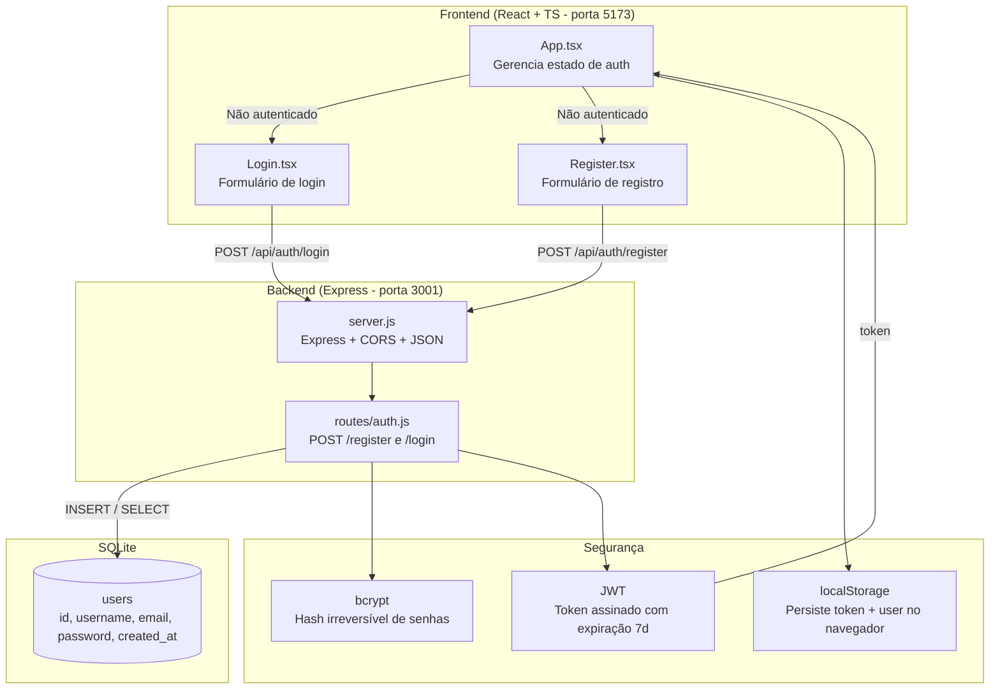
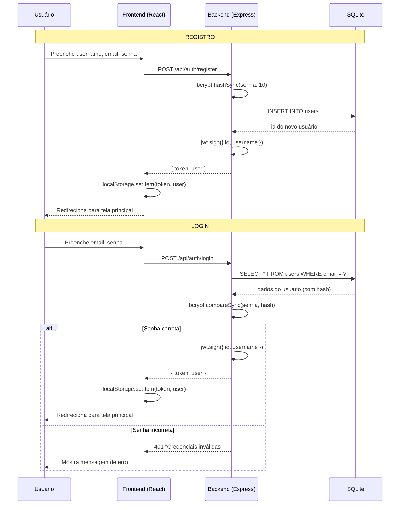

# Sprint Planner

Gerenciador de Sprints com Inteligência Artificial.
Aplicação web para times pequenos gerenciarem sprints de forma intuitiva, com board Kanban, dashboards e assistência de IA.

## Comandos

- **Backend**: `cd backend && npm install && npm run dev`
- **Frontend**: `cd frontend && npm install && npx vite --port 5173`
- **Type check**: `cd frontend && npx tsc --noEmit`
- **Testar API**: `curl -s http://localhost:3001/api/health`

## Stack Tecnológica

| Camada | Tecnologia |
|--------|-----------|
| Frontend | React 18 + TypeScript, Tailwind CSS v3, Vite 5 |
| Backend | Node.js + Express 4, API REST |
| Banco | SQLite via better-sqlite3 |
| Auth | bcrypt (hash de senhas) + JWT (tokens) |
| IA | Claude API (Anthropic) - features do produto |

> **Nota**: Node.js 20.18 requer Vite 5 (não Vite 6+). Tailwind v3 usa PostCSS (não plugin Vite).

## Estrutura do Projeto

```
sprint-planner/
├── backend/
│   ├── src/
│   │   ├── server.js          # Servidor Express + middlewares + montagem de rotas
│   │   ├── database.js        # Conexão SQLite + criação de tabelas
│   │   └── routes/
│   │       └── auth.js        # POST /register e /login (bcrypt + JWT)
│   └── package.json
├── frontend/
│   ├── src/
│   │   ├── main.tsx           # Entry point React
│   │   ├── App.tsx            # Componente raiz - gerencia estado de auth
│   │   ├── index.css          # Tailwind imports
│   │   └── pages/
│   │       ├── Login.tsx      # Formulário de login
│   │       └── Register.tsx   # Formulário de registro
│   ├── tailwind.config.js
│   └── package.json
├── CLAUDE.md                  # Este arquivo
└── .gitignore
```

## Padrões de Código

- **Indentação**: 2 espaços (não tabs)
- **Backend**: CommonJS (`require`/`module.exports`), JavaScript puro
- **Frontend**: ESModules (`import`/`export`), TypeScript estrito
- **Nomes de arquivo**: kebab-case para pastas, PascalCase para componentes React
- **Variáveis/funções**: camelCase
- **Comentários**: todo código deve ser bem comentado explicando o "porquê", não apenas o "quê"

## Regras de Commit

1. **Máximo ~100 linhas de código por commit** (scaffold/gerado não conta)
2. **Mensagem clara**: título curto + corpo explicando o que e por quê
3. **Diagrama Mermaid**: cada commit deve incluir ou atualizar um diagrama `.md` documentando a arquitetura/fluxo alterado
4. **Código comentado**: todo código novo deve ter comentários explicativos
5. **Testar antes de commitar**: rodar type check no frontend e testar endpoints no backend
6. **Co-author**: incluir `Co-Authored-By: Claude Opus 4.6 (1M context) <noreply@anthropic.com>`

## Endpoints da API

| Método | Rota | Descrição | Body |
|--------|------|-----------|------|
| GET | `/api/health` | Health check | - |
| POST | `/api/auth/register` | Criar conta | `{ username, email, password }` |
| POST | `/api/auth/login` | Login | `{ email, password }` |

## Histórias de Usuário (Roadmap)

- [x] **US1**: Criar conta e fazer login
- [ ] **US2**: Criar projeto e convidar membros
- [ ] **US3**: Adicionar histórias ao backlog (PO)
- [ ] **US4**: Criar sprint com datas
- [ ] **US5**: Mover histórias do backlog para o sprint
- [ ] **US6**: Board Kanban (To Do / In Progress / In Review / Done)
- [ ] **US7**: Dashboard com progresso do sprint
- [ ] **US8**: Gerar sugestões de histórias via IA
- [ ] **US9**: Encerrar sprint com resumo automático por IA

## Arquitetura (Mermaid)



## Fluxo de Autenticação (Mermaid)


