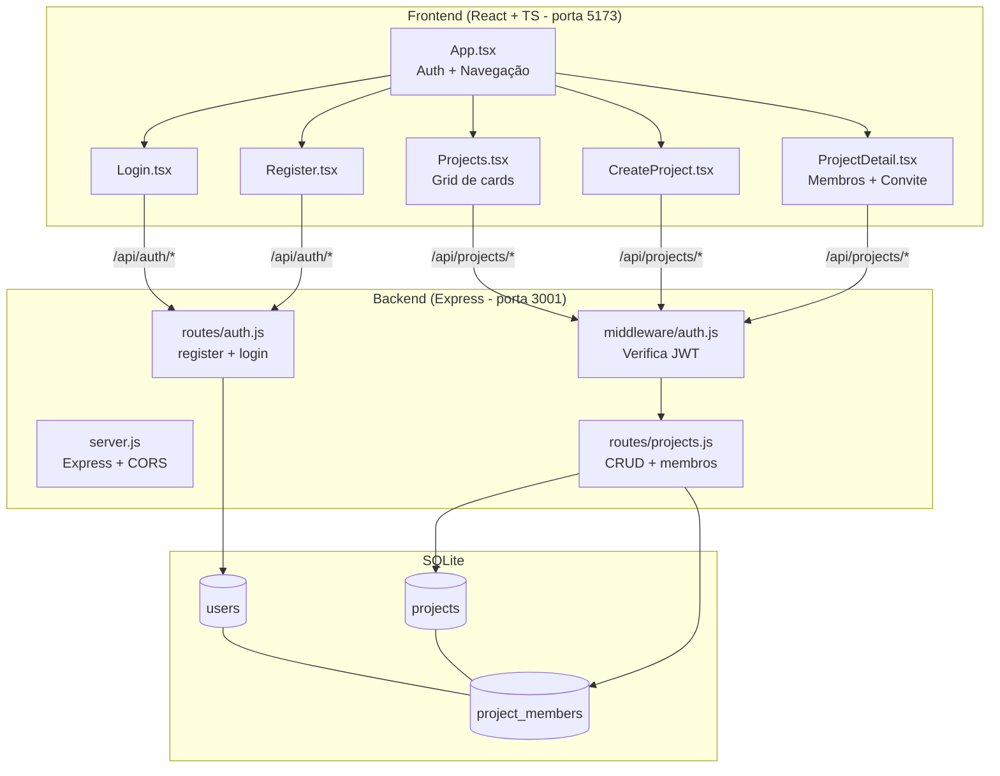
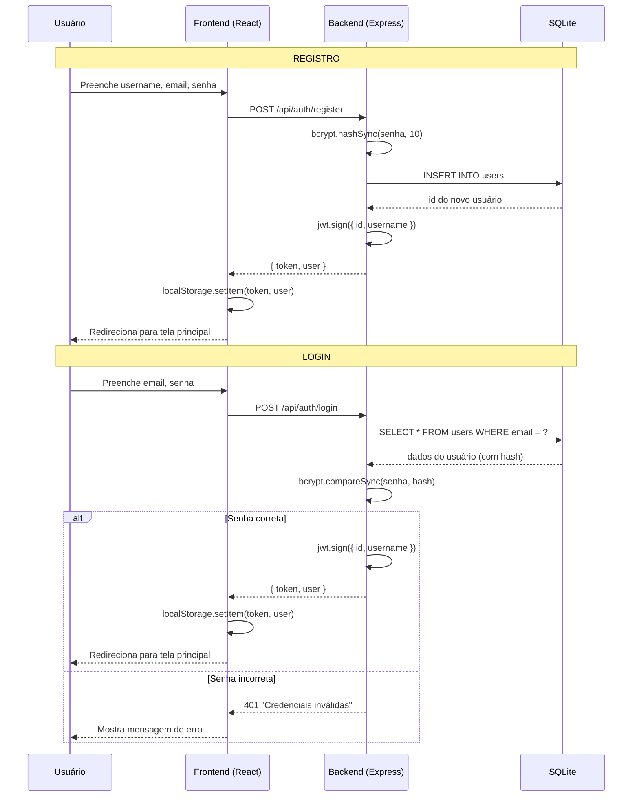

# Sprint Planner

Gerenciador de Sprints com Inteligência Artificial.
Aplicação web para times pequenos gerenciarem sprints de forma intuitiva, com board Kanban, dashboards e assistência de IA.

## Comandos

- **Backend**: `cd backend && npm install && npm run dev`
- **Frontend**: `cd frontend && npm install && npx vite --port 5173`
- **Type check**: `cd frontend && npx tsc --noEmit`
- **Testar API**: `curl -s http://localhost:3001/api/health`

## Stack Tecnológica

| Camada | Tecnologia |
|--------|-----------|
| Frontend | React 18 + TypeScript, Tailwind CSS v3, Vite 5 |
| Backend | Node.js + Express 4, API REST |
| Banco | SQLite via better-sqlite3 |
| Auth | bcrypt (hash de senhas) + JWT (tokens) |
| IA | Claude API (Anthropic) - features do produto |

> **Nota**: Node.js 20.18 requer Vite 5 (não Vite 6+). Tailwind v3 usa PostCSS (não plugin Vite).

## Estrutura do Projeto

```
sprint-planner/
├── backend/
│   ├── src/
│   │   ├── server.js          # Servidor Express + middlewares + montagem de rotas
│   │   ├── database.js        # Conexão SQLite + criação de tabelas (users, projects, project_members)
│   │   ├── middleware/
│   │   │   └── auth.js        # Middleware JWT - verifica token e anexa req.user
│   │   └── routes/
│   │       ├── auth.js        # POST /register e /login (bcrypt + JWT)
│   │       └── projects.js    # CRUD projetos + convite/listagem de membros
│   └── package.json
├── frontend/
│   ├── src/
│   │   ├── main.tsx           # Entry point React
│   │   ├── App.tsx            # Componente raiz - gerencia auth + navegação
│   │   ├── index.css          # Tailwind imports
│   │   └── pages/
│   │       ├── Login.tsx          # Formulário de login
│   │       ├── Register.tsx       # Formulário de registro
│   │       ├── Projects.tsx       # Lista de projetos (grid cards)
│   │       ├── CreateProject.tsx  # Formulário criar projeto
│   │       └── ProjectDetail.tsx  # Detalhes + convite de membros
│   ├── tailwind.config.js
│   └── package.json
├── docs/
│   └── commits.md             # Diagramas Mermaid de cada commit
├── CLAUDE.md                  # Este arquivo
└── .gitignore
```

## Padrões de Código

- **Indentação**: 2 espaços (não tabs)
- **Backend**: CommonJS (`require`/`module.exports`), JavaScript puro
- **Frontend**: ESModules (`import`/`export`), TypeScript estrito
- **Nomes de arquivo**: kebab-case para pastas, PascalCase para componentes React
- **Variáveis/funções**: camelCase
- **Comentários**: todo código deve ser bem comentado explicando o "porquê", não apenas o "quê"

## Regras de Commit

1. **Máximo ~100 linhas de código por commit** (scaffold/gerado não conta)
2. **Mensagem clara**: título curto + corpo explicando o que e por quê
3. **Diagrama Mermaid**: cada commit deve incluir ou atualizar `docs/commits.md` com um diagrama Mermaid documentando o que foi feito
4. **Código comentado**: todo código novo deve ter comentários explicativos
5. **Testar antes de commitar**: rodar type check no frontend e testar endpoints no backend
6. **Co-author**: incluir `Co-Authored-By: Claude Opus 4.6 (1M context) <noreply@anthropic.com>`

## Endpoints da API

| Método | Rota | Descrição | Body | Auth |
|--------|------|-----------|------|------|
| GET | `/api/health` | Health check | - | Não |
| POST | `/api/auth/register` | Criar conta | `{ username, email, password }` | Não |
| POST | `/api/auth/login` | Login | `{ email, password }` | Não |
| POST | `/api/projects` | Criar projeto | `{ name, description }` | JWT |
| GET | `/api/projects` | Listar projetos do usuário | - | JWT |
| POST | `/api/projects/:id/members` | Convidar membro (cria invitation pendente) | `{ identifier, role }` | JWT (owner) |
| GET | `/api/projects/:id/members` | Listar membros | - | JWT (membro) |
| GET | `/api/invitations` | Listar convites pendentes do usuário | - | JWT |
| POST | `/api/invitations/:id/accept` | Aceitar convite (vira membro) | - | JWT (invitee) |
| POST | `/api/invitations/:id/reject` | Rejeitar convite | - | JWT (invitee) |
| POST | `/api/projects/:id/stories` | Cria história no backlog | `{ title, description?, story_points?, label? }` | JWT (membro) |
| GET | `/api/projects/:id/stories` | Lista histórias do backlog | `?include=all` (opcional) | JWT (membro) |
| PUT | `/api/stories/:id` | Atualiza história (parcial) | qualquer campo | JWT (membro) |
| DELETE | `/api/stories/:id` | Remove história | - | JWT (membro) |
| POST | `/api/projects/:id/sprints` | Cria sprint do projeto | `{ name, goal?, start_date?, end_date?, status? }` | JWT (membro) |
| GET | `/api/projects/:id/sprints` | Lista sprints do projeto | - | JWT (membro) |
| PUT | `/api/sprints/:id` | Atualiza sprint (parcial) | qualquer campo | JWT (membro) |
| DELETE | `/api/sprints/:id` | Remove sprint | - | JWT (membro) |
| GET | `/api/sprints/:id/dashboard` | Métricas agregadas do sprint (pontos, progresso, status) | - | JWT (membro) |
| GET | `/api/projects/:id/velocity` | Média de pontos concluídos em sprints passados | - | JWT (membro) |

## Histórias de Usuário (Roadmap)

- [x] **US1**: Criar conta e fazer login
- [x] **US2**: Criar projeto e convidar membros
- [x] **US3**: Adicionar histórias ao backlog (PO)
- [x] **US4**: Criar sprint com datas
- [ ] **US5**: Mover histórias do backlog para o sprint
- [ ] **US6**: Board Kanban (To Do / In Progress / In Review / Done)
- [x] **US7**: Dashboard com progresso do sprint
- [ ] **US8**: Gerar sugestões de histórias via IA
- [ ] **US9**: Encerrar sprint com resumo automático por IA

## Arquitetura (Mermaid)



## Fluxo de Autenticação (Mermaid)


