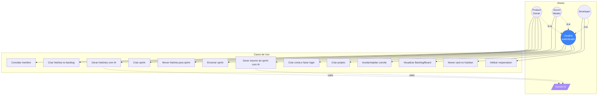
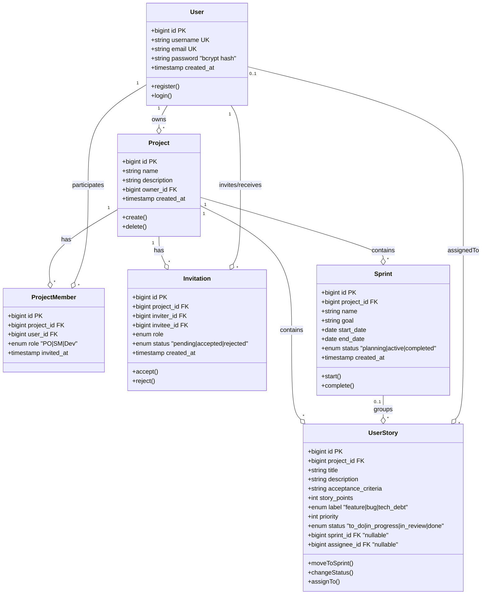
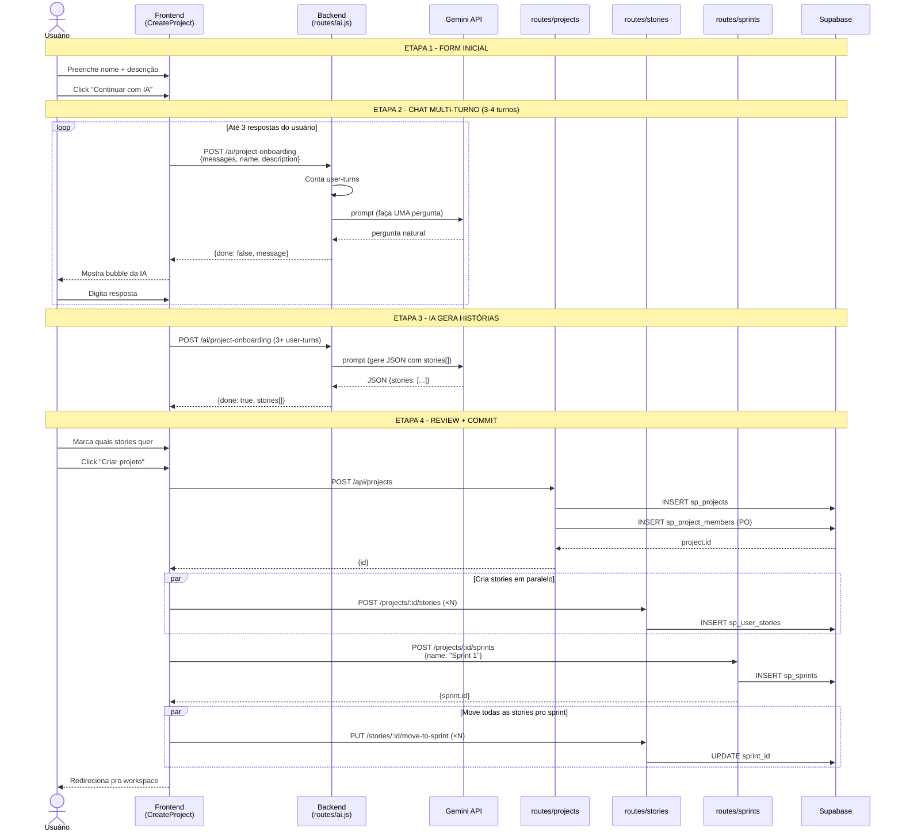
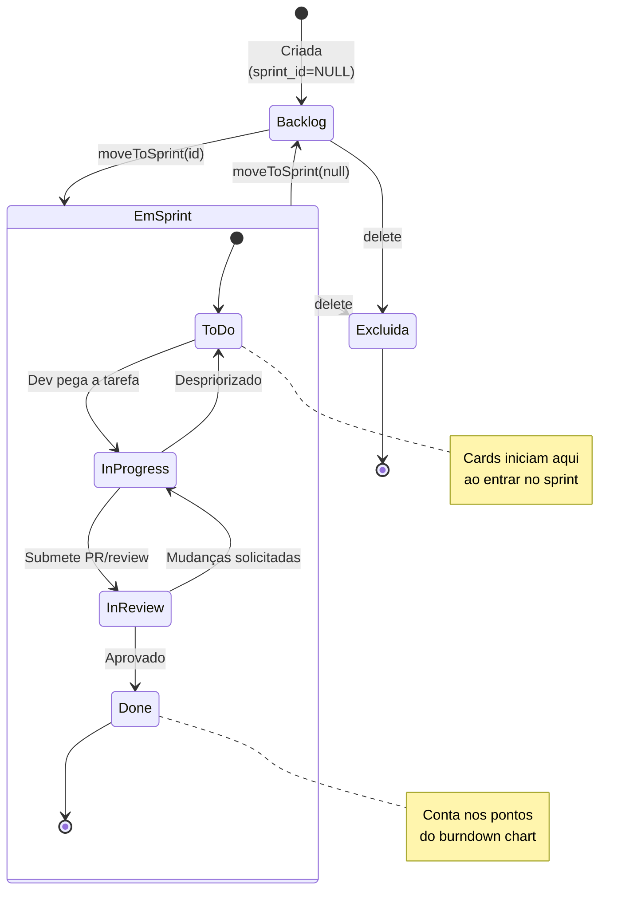
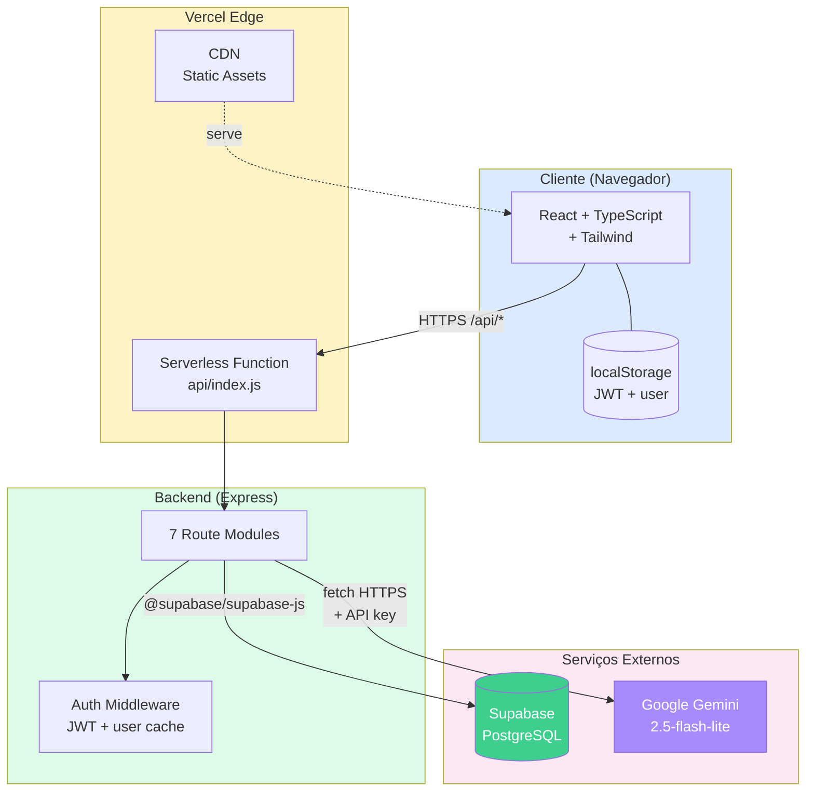

# 🎯 Sprint Planner

> Gerenciador de sprints Scrum com Inteligência Artificial integrada.

**Demo em produção:** https://sprint-planner-murex.vercel.app
**Repositório:** https://github.com/Lucas139Miller/Sprint-Planner

---

## 📋 Sobre o Projeto

Aplicação web para times pequenos gerenciarem projetos no método **Scrum** — equivalente simplificado do Jira/Linear/Trello, com **IA do Google Gemini** integrada para acelerar o planejamento.

**9 user stories implementadas:**

- ✅ US1: Criar conta e fazer login (bcrypt + JWT)
- ✅ US2: Criar projeto e convidar membros (fluxo de aceitação)
- ✅ US3: Backlog de histórias com priority, label, story points
- ✅ US4: Sprints com status (planning / active / completed)
- ✅ US5: Mover histórias backlog ↔ sprint
- ✅ US6: Board Kanban com drag & drop nativo
- ✅ US7: Dashboard com burndown (recharts)
- ✅ US8: Gerar histórias com IA (Gemini)
- ✅ US9: Resumo retrospectivo automático de sprint (Gemini)

---

## ⚙️ Stack

| Camada | Tecnologia |
|--------|-----------|
| **Frontend** | React 18 + TypeScript + Tailwind CSS + Vite 5 |
| **Backend** | Node.js + Express 4 (serverless via Vercel Functions) |
| **Banco** | Supabase (PostgreSQL) |
| **Auth** | bcrypt + JWT |
| **IA** | Google Gemini 2.5 Flash Lite (via fetch HTTP direto) |
| **Deploy** | Vercel (CDN + serverless) |

---

## 🚀 Como rodar localmente

```bash
# Backend (porta 3001)
cd backend
npm install
cp .env.example .env   # depois preencha SUPABASE_*, JWT_SECRET, GEMINI_API_KEY
npm run dev

# Frontend (porta 5173)
cd ../frontend
npm install
npx vite --port 5173
```

Abra http://localhost:5173

---

## 📐 Documentação UML

Diagramas em **Mermaid**, renderizados automaticamente no GitHub.

### 1️⃣ Diagrama de Casos de Uso

Atores e operações principais do sistema.



**Como ler:** o usuário autenticado tem 3 papéis Scrum possíveis. PO inicia o trabalho (cria projeto, backlog, sprints), Dev executa no Kanban, SM encerra e revisa. Casos com `-.uses.->` indicam dependência de serviço externo (Gemini).

---

### 2️⃣ Diagrama de Classes (Entidades + Relacionamentos)

Modelo de dados completo (6 tabelas no Supabase).



**Como ler:**

- **`UK`** = unique key, **`PK`** = primary key, **`FK`** = foreign key
- `ON DELETE CASCADE` em todas as FKs (deletar projeto remove membros, sprints e stories)
- `UNIQUE(project_id, user_id)` em ProjectMember previne membro duplicado
- `CHECK` constraints no banco garantem `role` e `status` válidos
- Story.sprint_id é **nullable** (null = está no backlog)

---

### 3️⃣ Diagrama de Sequência — Criar projeto com Wizard IA

Fluxo crítico do projeto: wizard conversacional com Gemini que termina criando projeto + histórias + sprint inicial.



**Por que esse fluxo importa:** o PO sai do wizard com **projeto + backlog populado + Sprint 1 ativo + stories já no sprint**. Eliminou-se a etapa "tela branca" que existe no Jira/Trello.

---

### 4️⃣ Diagrama de Estados — Ciclo de vida de uma História de Usuário

Estados possíveis de uma `UserStory` e suas transições.



**Regras:**

- Toda história nasce no **Backlog** (sprint_id = NULL)
- Ao ser movida pra um sprint, entra na coluna **ToDo** do Kanban
- 4 estados internos do sprint: `to_do | in_progress | in_review | done` (CHECK constraint no banco)
- Pode voltar pro backlog a qualquer momento (sprint_id = NULL novamente)
- Done não é "final absoluto" — pode voltar pra InProgress se review pedir mudanças
- Sprint completed não aceita novas histórias

---

### 5️⃣ Diagrama de Componentes (Arquitetura)

Visão geral das camadas e suas interações.



**Pontos-chave:**

- **Mesmo domínio frontend/backend**: requisições `/api/*` ficam same-origin (zero CORS)
- **Serverless** = sem servidor 24/7; código roda só quando alguém chama
- **Chaves Gemini/Supabase**: APENAS no backend (encrypted vault da Vercel). Frontend nunca conhece
- **JWT no localStorage**: enviado em todo fetch para autenticação stateless

---

## 🔐 Segurança

| Camada | Proteção |
|--------|----------|
| Senhas | bcrypt rounds=10 (irreversível) |
| Sessão | JWT assinado, expira em 7d, valida user existe no DB |
| SQL Injection | Supabase JS parametriza tudo |
| IDOR | `isMember()` check em toda rota; FK validation em move-to-sprint |
| Secrets | `.env` gitignored + Vercel encrypted vault |
| Banco | CHECK constraints + UNIQUE + FK CASCADE |
| IA | Chave Gemini só no backend (proxy via /api/ai/*) |

---

## 📁 Estrutura

```
sprint-planner/
├── backend/                  # Express + Supabase
│   └── src/
│       ├── app.js            # Express config (reusável)
│       ├── server.js         # Listen pra dev local
│       ├── database.js       # Cliente Supabase
│       ├── middleware/auth.js
│       └── routes/
│           ├── auth.js       # /register, /login
│           ├── projects.js   # CRUD + convites
│           ├── invitations.js
│           ├── stories.js    # CRUD + move + status
│           ├── sprints.js
│           ├── dashboard.js
│           └── ai.js         # 3 endpoints Gemini
│
├── api/index.js              # Handler serverless Vercel
├── vercel.json               # Config build + rewrites
│
├── frontend/                 # React + Vite
│   └── src/
│       ├── App.tsx           # Auth + navegação
│       ├── api.ts            # apiFetch helper
│       ├── components/       # Avatar, Skeleton, ConfirmModal, StoryDetailPanel
│       └── pages/            # 14 telas (login, workspace, backlog, board, etc.)
│
├── docs/
│   ├── commits.md            # Mermaid pra cada commit (~35)
│   └── class-diagram.md      # Diagramas detalhados
│
├── CLAUDE.md                 # Contexto pra IA dev
├── DEPLOY.md                 # Guia de deploy Vercel
└── APRESENTACAO.md           # Slides Marp 5min
```

---

## 📊 Endpoints da API

| Método | Rota | Descrição | Auth |
|--------|------|-----------|------|
| POST | `/api/auth/register` | Criar conta | - |
| POST | `/api/auth/login` | Login | - |
| POST | `/api/projects` | Criar projeto | JWT |
| GET | `/api/projects` | Listar projetos do usuário | JWT |
| DELETE | `/api/projects/:id` | Excluir projeto | JWT (owner) |
| POST | `/api/projects/:id/members` | Convidar membro | JWT (owner) |
| GET | `/api/projects/:id/members` | Listar membros | JWT (membro) |
| GET | `/api/invitations` | Convites pendentes | JWT |
| POST | `/api/invitations/:id/accept` | Aceitar | JWT |
| POST | `/api/invitations/:id/reject` | Rejeitar | JWT |
| POST | `/api/projects/:id/stories` | Criar história | JWT (membro) |
| GET | `/api/projects/:id/stories` | Listar backlog | JWT |
| PUT | `/api/stories/:id` | Atualizar história | JWT |
| DELETE | `/api/stories/:id` | Remover história | JWT |
| PUT | `/api/stories/:id/move-to-sprint` | Mover backlog↔sprint | JWT |
| PUT | `/api/stories/:id/status` | Mudar coluna Kanban | JWT |
| POST | `/api/projects/:id/sprints` | Criar sprint | JWT |
| GET | `/api/projects/:id/sprints` | Listar sprints | JWT |
| PUT | `/api/sprints/:id` | Atualizar sprint | JWT |
| DELETE | `/api/sprints/:id` | Remover sprint | JWT |
| GET | `/api/sprints/:id/board` | Kanban agrupado | JWT |
| GET | `/api/sprints/:id/dashboard` | Métricas | JWT |
| POST | `/api/ai/generate-stories` | Gerar com IA | JWT |
| POST | `/api/ai/sprint-summary` | Resumo retrospectivo | JWT |
| POST | `/api/ai/project-onboarding` | Wizard conversacional | JWT |

---

## 👥 Autores

Projeto desenvolvido em colaboração com Claude Code (Anthropic) para a disciplina de **Engenharia de Software (DCC 603)** — Prof. Marco Túlio Valente.

## 📝 Licença

MIT
