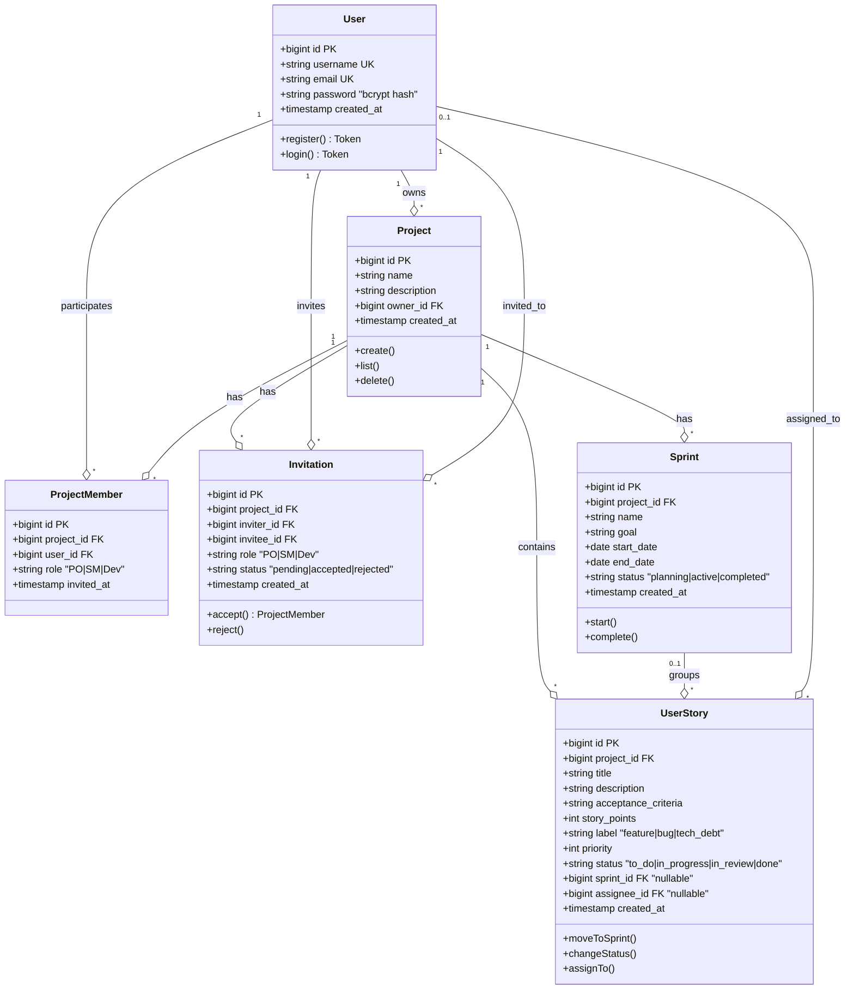
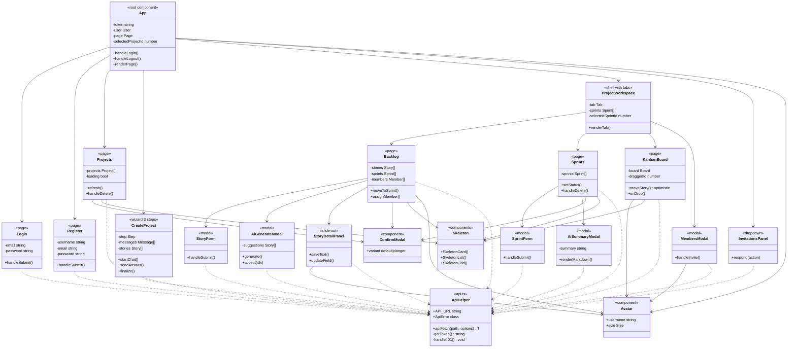
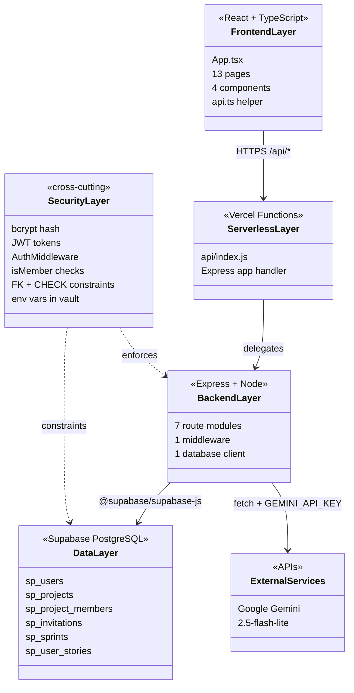
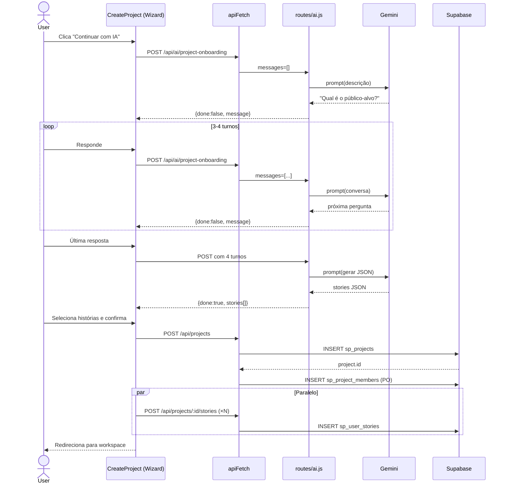

# Diagrama de Classes — Sprint Planner

Como o projeto é JavaScript/TypeScript sem classes formais, o diagrama representa:
- **Entidades do domínio** (tabelas Supabase) com seus atributos
- **Serviços de backend** (módulos de rotas) com operações principais
- **Componentes de frontend** (pages e components React) com responsabilidades
- **Relacionamentos** (1:N, N:N, dependências)

---

## 📦 Visão Geral — Entidades do Domínio



---

## 🔧 Backend — Camada de Serviços (Express Routes)

```mermaid
classDiagram
    class Database {
        <<Supabase Client>>
        +from(table) Query
        +select() Data
        +insert() Data
        +update() Data
        +delete() void
    }

    class AuthMiddleware {
        <<middleware>>
        +JWT_SECRET string
        +userCache Map
        +verify(token) Decoded
        +validateUserExists(id) bool
        +inject_req_user()
    }

    class AuthRoutes {
        <<routes/auth.js>>
        +POST_register()
        +POST_login()
        -hashPassword(plain) string
        -compareHash(plain, hash) bool
        -generateJWT(user) string
    }

    class ProjectRoutes {
        <<routes/projects.js>>
        +POST_create()
        +GET_list()
        +DELETE_remove()
        +POST_inviteMember()
        +GET_listMembers()
        -isMember(projectId, userId) bool
    }

    class InvitationRoutes {
        <<routes/invitations.js>>
        +GET_listPending()
        +POST_accept()
        +POST_reject()
    }

    class StoryRoutes {
        <<routes/stories.js>>
        +POST_create()
        +GET_listBacklog()
        +PUT_update()
        +DELETE_remove()
        +PUT_moveToSprint()
        +GET_sprintStories()
        +PUT_changeStatus()
        +GET_kanbanBoard()
        -getStoryAndCheckAccess(id, userId)
    }

    class SprintRoutes {
        <<routes/sprints.js>>
        +POST_create()
        +GET_list()
        +PUT_update()
        +DELETE_remove()
        -getSprintAndCheckAccess(id, userId)
    }

    class DashboardRoutes {
        <<routes/dashboard.js>>
        +GET_sprintMetrics()
        +GET_velocity()
    }

    class AiRoutes {
        <<routes/ai.js>>
        +POST_generateStories()
        +POST_sprintSummary()
        +POST_projectOnboarding()
        -callGemini(prompt) string
        -GEMINI_API_KEY string
        -GEMINI_MODEL string
    }

    class App {
        <<server.js>>
        +express()
        +useCors()
        +useJSON()
        +mountRoutes()
    }

    AuthMiddleware --> Database : queries users
    AuthRoutes --> Database
    ProjectRoutes --> Database
    InvitationRoutes --> Database
    StoryRoutes --> Database
    SprintRoutes --> Database
    DashboardRoutes --> Database
    AiRoutes --> Database

    ProjectRoutes ..> AuthMiddleware : uses
    InvitationRoutes ..> AuthMiddleware : uses
    StoryRoutes ..> AuthMiddleware : uses
    SprintRoutes ..> AuthMiddleware : uses
    DashboardRoutes ..> AuthMiddleware : uses
    AiRoutes ..> AuthMiddleware : uses

    App --> AuthRoutes : mount /api/auth
    App --> ProjectRoutes : mount /api/projects
    App --> InvitationRoutes : mount /api/invitations
    App --> StoryRoutes : mount /api
    App --> SprintRoutes : mount /api
    App --> DashboardRoutes : mount /api
    App --> AiRoutes : mount /api/ai

    AiRoutes ..> "Gemini API" : HTTPS
```

---

## 🎨 Frontend — Componentes React



---

## 🌐 Visão Completa — Camadas



---

## 🔄 Fluxo: Criar projeto com IA (sequência)



---

## 🔐 Modelo de Autorização

```mermaid
classDiagram
    class Request {
        +headers.Authorization
        +body
        +params
    }

    class AuthMiddleware {
        +verify(token) Decoded
        +validateUserExists(id) bool
        ±userCache 60s TTL
    }

    class IsMemberCheck {
        <<helper>>
        +isMember(projectId, userId) bool
    }

    class GetStoryAndCheckAccess {
        <<helper>>
        +returns {story, error}
    }

    class GetSprintAndCheckAccess {
        <<helper>>
        +returns {sprint, error}
    }

    class CrossProjectIDOR {
        <<rule>>
        sprint.project_id == story.project_id
    }

    class OwnerOnlyOps {
        <<rule>>
        DELETE project: only owner_id
        Invite member: only owner_id
    }

    Request --> AuthMiddleware : 401 if invalid
    AuthMiddleware --> IsMemberCheck : sets req.user
    IsMemberCheck --> GetStoryAndCheckAccess
    IsMemberCheck --> GetSprintAndCheckAccess
    GetStoryAndCheckAccess --> CrossProjectIDOR
    AuthMiddleware --> OwnerOnlyOps
```

---

## 📊 Resumo dos relacionamentos

| Origem | Cardinalidade | Destino | Tipo |
|--------|--------------|---------|------|
| User | 1:N | Project | owner |
| User | N:N (via ProjectMember) | Project | participação |
| User | 1:N | Invitation | inviter / invitee |
| User | 1:N | UserStory | assignee (opcional) |
| Project | 1:N | Sprint | tem |
| Project | 1:N | UserStory | contém |
| Sprint | 1:N | UserStory | agrupa (opcional) |

**11 entidades / módulos principais**, **20+ relacionamentos**.
