# Histórico de Commits - Sprint Planner

Documentação visual de cada commit com diagramas Mermaid mostrando a evolução da arquitetura.

---

## Commit 1 — `10dd475` Inicializa backend com Express e banco SQLite

**O que foi feito:** Criou a base do servidor backend com Express e o banco de dados SQLite com a tabela de usuários.

**Arquivos criados:** `.gitignore`, `backend/package.json`, `backend/src/server.js`, `backend/src/database.js`

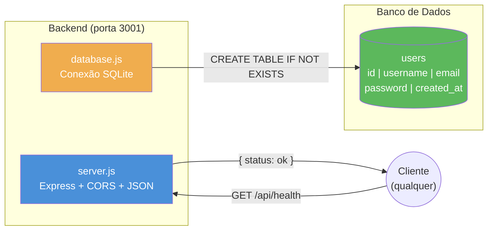
```mermaid
graph LR
    subgraph Backend["Backend (porta 3001)"]
        Server["server.js<br/>Express + CORS + JSON"]
        DB["database.js<br/>Conexão SQLite"]
    end

    subgraph SQLite["Banco de Dados"]
        Users[("users<br/>id | username | email<br/>password | created_at")]
    end

    Client(("Cliente<br/>(qualquer)")) -->|"GET /api/health"| Server
    Server -->|"{ status: ok }"| Client
    DB -->|"CREATE TABLE IF NOT EXISTS"| Users

    style Server fill:#4a90d9,color:#fff
    style DB fill:#f0ad4e,color:#fff
    style Users fill:#5cb85c,color:#fff
```

**Conceitos introduzidos:**
- Express como framework HTTP
- SQLite como banco local (arquivo `.db`)
- CORS para permitir requisições cross-origin
- Health check como rota de verificação

---

## Commit 2 — `acf9b2a` Adiciona rotas de registro e login com JWT

**O que foi feito:** Implementou as duas rotas de autenticação: registro (criar conta) e login. Usa bcrypt para hash de senhas e JWT para tokens.

**Arquivos criados:** `backend/src/routes/auth.js`  
**Arquivos modificados:** `backend/src/server.js` (adicionou import + montagem das rotas)

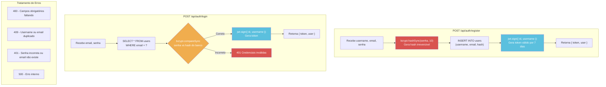
```mermaid
graph TB
    subgraph Registro["POST /api/auth/register"]
        R1["Recebe username, email, senha"] --> R2["bcrypt.hashSync(senha, 10)<br/>Gera hash irreversível"]
        R2 --> R3["INSERT INTO users<br/>(username, email, hash)"]
        R3 --> R4["jwt.sign({ id, username })<br/>Gera token válido por 7 dias"]
        R4 --> R5["Retorna { token, user }"]
    end

    subgraph Login["POST /api/auth/login"]
        L1["Recebe email, senha"] --> L2["SELECT * FROM users<br/>WHERE email = ?"]
        L2 --> L3{"bcrypt.compareSync<br/>senha vs hash do banco"}
        L3 -->|"Correto"| L4["jwt.sign({ id, username })<br/>Gera token"]
        L3 -->|"Incorreto"| L5["401 Credenciais inválidas"]
        L4 --> L6["Retorna { token, user }"]
    end

    subgraph Erros["Tratamento de Erros"]
        E1["400 - Campos obrigatórios faltando"]
        E2["409 - Username ou email duplicado"]
        E3["401 - Senha incorreta ou email não existe"]
        E4["500 - Erro interno"]
    end

    style R2 fill:#d9534f,color:#fff
    style R4 fill:#5bc0de,color:#fff
    style L3 fill:#f0ad4e,color:#fff
    style L4 fill:#5bc0de,color:#fff
    style L5 fill:#d9534f,color:#fff
```

**Conceitos introduzidos:**
- **bcrypt**: hash de senha com salt (10 rounds) — irreversível, mesmo com acesso ao banco não se descobre a senha
- **JWT**: token assinado digitalmente contendo `{ id, username }`, expira em 7 dias
- **Prepared statements** (`?`): previnem SQL Injection
- **Mensagem genérica de erro** no login: não revela se o email existe ou se a senha está errada

---

## Commit 3 — `18c9474` Inicializa frontend React + TypeScript com Tailwind CSS

**O que foi feito:** Criou o projeto frontend com Vite (scaffold React + TypeScript). Configurou Tailwind CSS para estilização. Limpou os arquivos de template.

**Arquivos criados:** Todo o diretório `frontend/` (scaffold Vite)  
**Arquivos modificados:** `App.tsx` (limpou template), `index.css` (Tailwind), `vite.config.ts` (plugin)

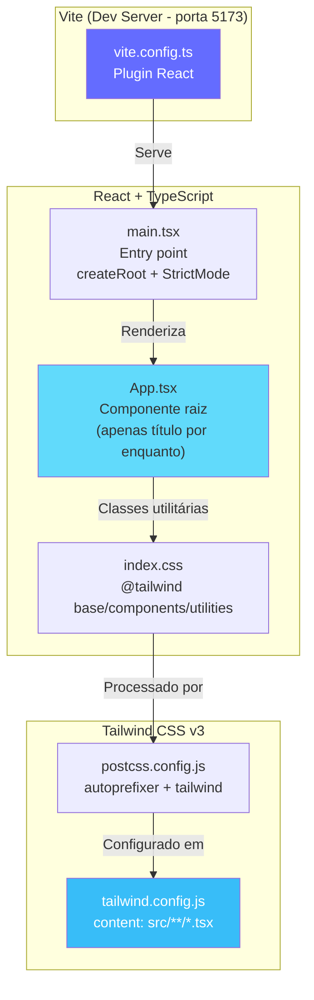
```mermaid
graph TB
    subgraph Vite["Vite (Dev Server - porta 5173)"]
        Config["vite.config.ts<br/>Plugin React"]
    end

    subgraph React["React + TypeScript"]
        Main["main.tsx<br/>Entry point<br/>createRoot + StrictMode"]
        App["App.tsx<br/>Componente raiz<br/>(apenas título por enquanto)"]
        CSS["index.css<br/>@tailwind base/components/utilities"]
    end

    subgraph Tailwind["Tailwind CSS v3"]
        TW_Config["tailwind.config.js<br/>content: src/**/*.tsx"]
        PostCSS["postcss.config.js<br/>autoprefixer + tailwind"]
    end

    Config -->|"Serve"| Main
    Main -->|"Renderiza"| App
    App -->|"Classes utilitárias"| CSS
    CSS -->|"Processado por"| PostCSS
    PostCSS -->|"Configurado em"| TW_Config

    style Config fill:#646cff,color:#fff
    style App fill:#61dafb,color:#333
    style TW_Config fill:#38bdf8,color:#fff
```

**Conceitos introduzidos:**
- **Vite**: bundler rápido com HMR (Hot Module Replacement)
- **TypeScript**: tipagem estática para JavaScript
- **Tailwind CSS**: classes utilitárias (`bg-blue-700`, `p-4`, `rounded`) direto no HTML
- **Scaffold limpo**: removeu boilerplate do Vite (logos, contador, CSS padrão)

---

## Commit 4 — `a4adcec` Adiciona páginas de Login e Registro

**O que foi feito:** Criou os dois componentes de formulário (Login e Register) com validação, chamadas à API e exibição de erros.

**Arquivos criados:** `frontend/src/pages/Login.tsx`, `frontend/src/pages/Register.tsx`

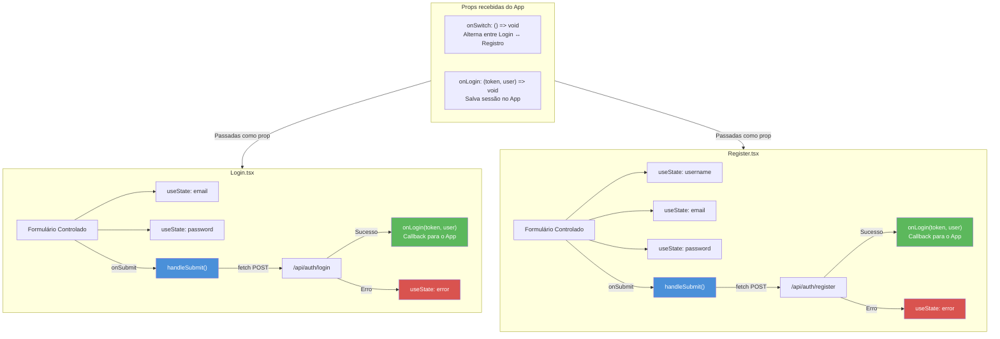
```mermaid
graph TB
    subgraph LoginPage["Login.tsx"]
        LF["Formulário Controlado"]
        LE["useState: email"]
        LP["useState: password"]
        LErr["useState: error"]
        LSubmit["handleSubmit()"]

        LF --> LE & LP
        LF -->|"onSubmit"| LSubmit
        LSubmit -->|"fetch POST"| API_Login["/api/auth/login"]
        API_Login -->|"Sucesso"| OnLogin["onLogin(token, user)<br/>Callback para o App"]
        API_Login -->|"Erro"| LErr
    end

    subgraph RegisterPage["Register.tsx"]
        RF["Formulário Controlado"]
        RU["useState: username"]
        RE["useState: email"]
        RP["useState: password"]
        RErr["useState: error"]
        RSubmit["handleSubmit()"]

        RF --> RU & RE & RP
        RF -->|"onSubmit"| RSubmit
        RSubmit -->|"fetch POST"| API_Register["/api/auth/register"]
        API_Register -->|"Sucesso"| OnLogin2["onLogin(token, user)<br/>Callback para o App"]
        API_Register -->|"Erro"| RErr
    end

    subgraph Props["Props recebidas do App"]
        P1["onSwitch: () => void<br/>Alterna entre Login ↔ Registro"]
        P2["onLogin: (token, user) => void<br/>Salva sessão no App"]
    end

    Props -->|"Passadas como prop"| LoginPage & RegisterPage

    style LSubmit fill:#4a90d9,color:#fff
    style RSubmit fill:#4a90d9,color:#fff
    style OnLogin fill:#5cb85c,color:#fff
    style OnLogin2 fill:#5cb85c,color:#fff
    style LErr fill:#d9534f,color:#fff
    style RErr fill:#d9534f,color:#fff
```

**Conceitos introduzidos:**
- **Formulários controlados**: cada input vinculado a um `useState` — React controla o valor
- **Props com callback**: filho (Login) avisa o pai (App) quando o login é bem-sucedido via `onLogin()`
- **fetch API**: requisições HTTP nativas do navegador para o backend
- **Validação HTML5**: `required` e `type="email"` validam antes de enviar

---

## Commit 5 — `74ed7d8` Integra autenticação no App com persistência em localStorage

**O que foi feito:** Conectou Login e Register ao App.tsx. Gerencia o estado de autenticação (logado/deslogado) com persistência no localStorage para sobreviver a recarregamentos.

**Arquivos modificados:** `frontend/src/App.tsx`

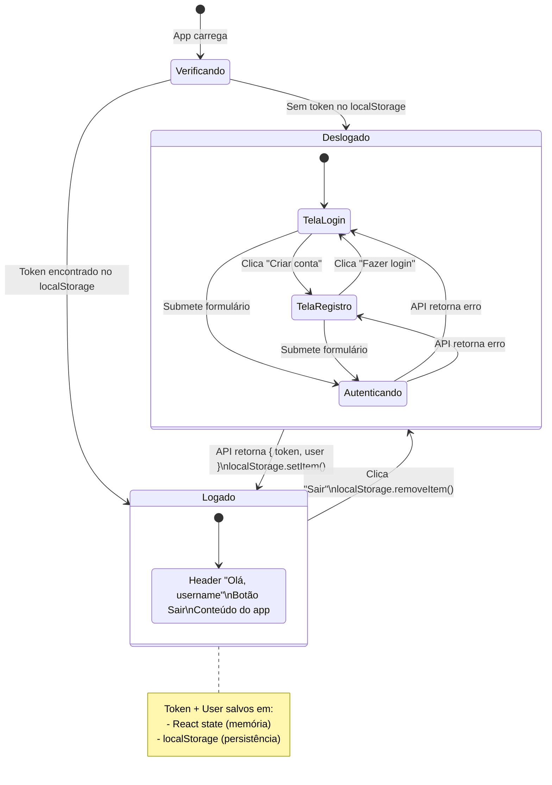
```mermaid
stateDiagram-v2
    [*] --> Verificando: App carrega

    Verificando --> Deslogado: Sem token no localStorage
    Verificando --> Logado: Token encontrado no localStorage

    state Deslogado {
        [*] --> TelaLogin
        TelaLogin --> TelaRegistro: Clica "Criar conta"
        TelaRegistro --> TelaLogin: Clica "Fazer login"

        TelaLogin --> Autenticando: Submete formulário
        TelaRegistro --> Autenticando: Submete formulário

        Autenticando --> TelaLogin: API retorna erro
        Autenticando --> TelaRegistro: API retorna erro
    }

    Deslogado --> Logado: API retorna { token, user }\nlocalStorage.setItem()

    state Logado {
        [*] --> TelaPrincipal
        TelaPrincipal: Header "Olá, username"\nBotão Sair\nConteúdo do app
    }

    Logado --> Deslogado: Clica "Sair"\nlocalStorage.removeItem()

    note right of Logado
        Token + User salvos em:
        - React state (memória)
        - localStorage (persistência)
    end note
```

**Conceitos introduzidos:**
- **localStorage**: armazenamento no navegador que persiste após fechar a aba
- **useEffect**: roda ao carregar o componente para recuperar sessão salva
- **Renderização condicional**: `if (!token)` decide qual tela mostrar
- **Lifting state up**: App é o "dono" do estado de auth, filhos comunicam via callbacks

---

## Commit 6 — `45555c0` Adiciona CLAUDE.md com padrões do projeto e diagramas Mermaid

**O que foi feito:** Criou o arquivo CLAUDE.md documentando stack, estrutura, comandos, regras de commit, endpoints e diagramas de arquitetura.

**Arquivos criados:** `CLAUDE.md`

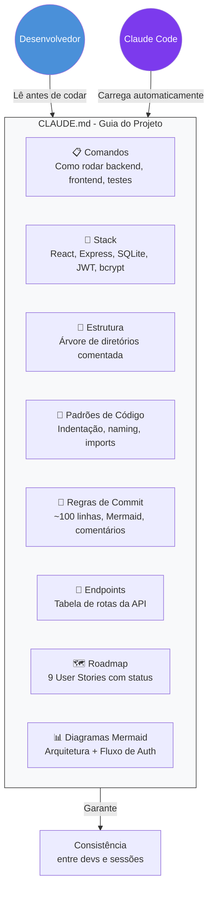
```mermaid
graph TB
    subgraph CLAUDE_MD["CLAUDE.md - Guia do Projeto"]
        S1["📋 Comandos<br/>Como rodar backend, frontend, testes"]
        S2["🔧 Stack<br/>React, Express, SQLite, JWT, bcrypt"]
        S3["📁 Estrutura<br/>Árvore de diretórios comentada"]
        S4["📏 Padrões de Código<br/>Indentação, naming, imports"]
        S5["📝 Regras de Commit<br/>~100 linhas, Mermaid, comentários"]
        S6["🔌 Endpoints<br/>Tabela de rotas da API"]
        S7["🗺️ Roadmap<br/>9 User Stories com status"]
        S8["📊 Diagramas Mermaid<br/>Arquitetura + Fluxo de Auth"]
    end

    Dev(("Desenvolvedor")) -->|"Lê antes de codar"| CLAUDE_MD
    Claude(("Claude Code")) -->|"Carrega automaticamente"| CLAUDE_MD

    CLAUDE_MD -->|"Garante"| Consistencia["Consistência<br/>entre devs e sessões"]

    style CLAUDE_MD fill:#f8f9fa,stroke:#333
    style Dev fill:#4a90d9,color:#fff
    style Claude fill:#7c3aed,color:#fff
```

**Conceitos introduzidos:**
- **CLAUDE.md**: arquivo de instruções persistentes carregado pelo Claude Code em toda sessão
- **Diagramas Mermaid**: visualização de arquitetura renderizada no GitHub
- **Roadmap com checklist**: tracking visual do progresso das user stories

---

## Commit 7 — `acfd105` Comenta todo o código e corrige compatibilidade Vite 5 + Tailwind v3

**O que foi feito:** Adicionou comentários explicativos em todos os arquivos. Corrigiu incompatibilidade do Vite 6 com Node 20.18, migrando para Vite 5 + Tailwind v3 com PostCSS.

**Arquivos modificados:** Todos os arquivos de código do backend e frontend

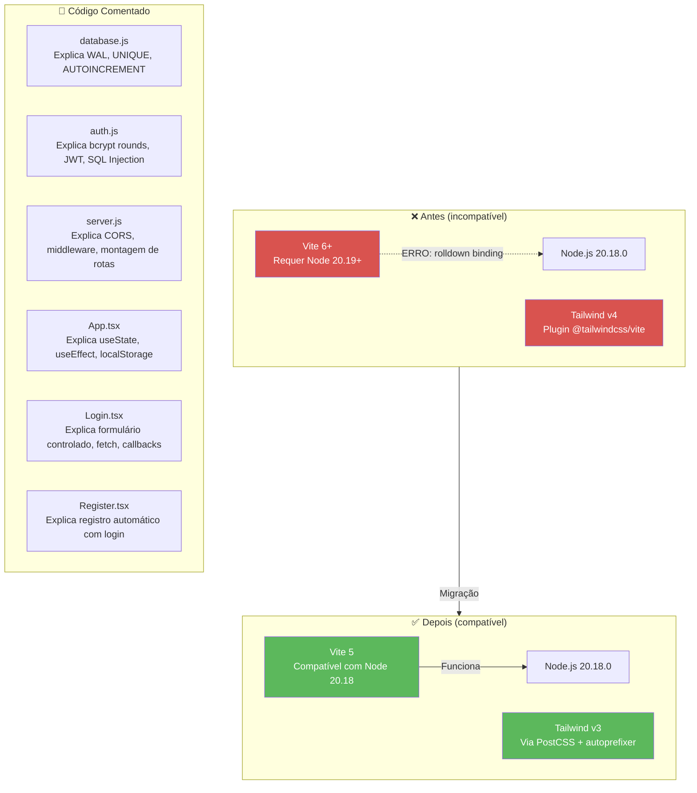
```mermaid
graph TB
    subgraph Antes["❌ Antes (incompatível)"]
        V6["Vite 6+<br/>Requer Node 20.19+"]
        TW4["Tailwind v4<br/>Plugin @tailwindcss/vite"]
        Node["Node.js 20.18.0"]
        V6 -.->|"ERRO: rolldown binding"| Node
    end

    subgraph Depois["✅ Depois (compatível)"]
        V5["Vite 5<br/>Compatível com Node 20.18"]
        TW3["Tailwind v3<br/>Via PostCSS + autoprefixer"]
        NodeOK["Node.js 20.18.0"]
        V5 -->|"Funciona"| NodeOK
    end

    subgraph Comentarios["📝 Código Comentado"]
        C1["database.js<br/>Explica WAL, UNIQUE, AUTOINCREMENT"]
        C2["auth.js<br/>Explica bcrypt rounds, JWT, SQL Injection"]
        C3["server.js<br/>Explica CORS, middleware, montagem de rotas"]
        C4["App.tsx<br/>Explica useState, useEffect, localStorage"]
        C5["Login.tsx<br/>Explica formulário controlado, fetch, callbacks"]
        C6["Register.tsx<br/>Explica registro automático com login"]
    end

    Antes -->|"Migração"| Depois

    style V6 fill:#d9534f,color:#fff
    style V5 fill:#5cb85c,color:#fff
    style TW4 fill:#d9534f,color:#fff
    style TW3 fill:#5cb85c,color:#fff
```

**Conceitos introduzidos:**
- **Compatibilidade de versões**: Node 20.18 não suporta Vite 6+ (que usa rolldown nativo)
- **PostCSS**: processador CSS que o Tailwind v3 usa para compilar as classes utilitárias
- **Código auto-documentado**: comentários explicando o "porquê" de cada decisão

---

## Commit 8 — Adiciona tabelas projects/project_members e middleware JWT

**O que foi feito:** Criou as tabelas de projetos e membros no banco de dados. Criou o middleware de autenticação JWT que protege rotas privadas.

**Arquivos criados:** `backend/src/middleware/auth.js`  
**Arquivos modificados:** `backend/src/database.js`

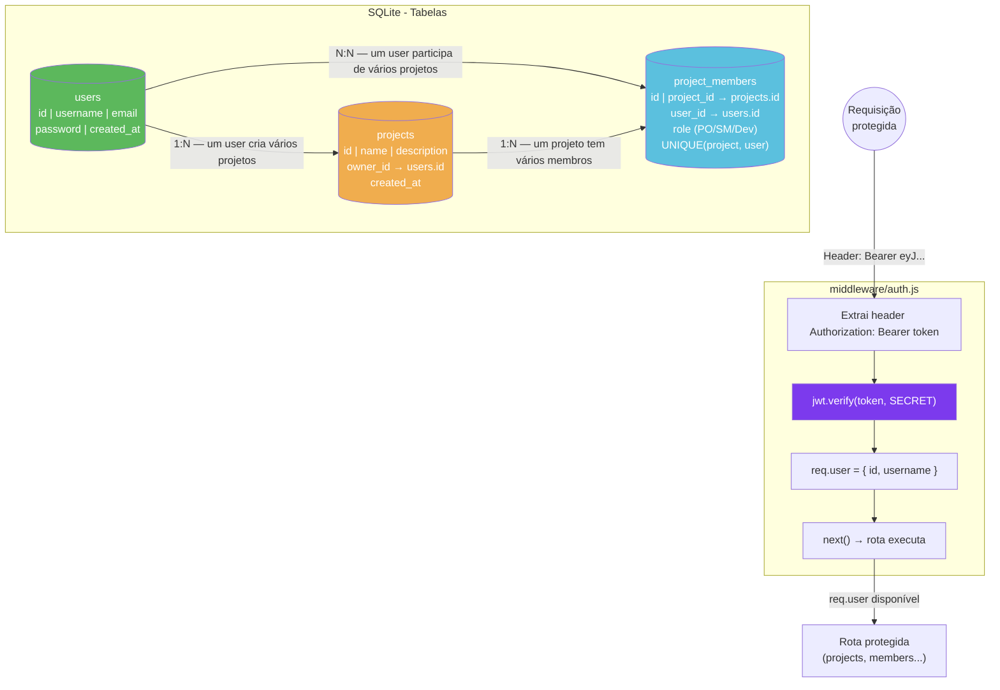
```mermaid
graph TB
    subgraph Banco["SQLite - Tabelas"]
        Users[("users<br/>id | username | email<br/>password | created_at")]
        Projects[("projects<br/>id | name | description<br/>owner_id → users.id<br/>created_at")]
        Members[("project_members<br/>id | project_id → projects.id<br/>user_id → users.id<br/>role (PO/SM/Dev)<br/>UNIQUE(project, user)")]
    end

    Users -->|"1:N — um user cria vários projetos"| Projects
    Users -->|"N:N — um user participa de vários projetos"| Members
    Projects -->|"1:N — um projeto tem vários membros"| Members

    subgraph Middleware["middleware/auth.js"]
        MW1["Extrai header Authorization: Bearer token"]
        MW2["jwt.verify(token, SECRET)"]
        MW3["req.user = { id, username }"]
        MW4["next() → rota executa"]
    end

    MW1 --> MW2 --> MW3 --> MW4

    ReqProtegida(("Requisição<br/>protegida")) -->|"Header: Bearer eyJ..."| MW1
    MW4 -->|"req.user disponível"| Rota["Rota protegida<br/>(projects, members...)"]

    style Projects fill:#f0ad4e,color:#fff
    style Members fill:#5bc0de,color:#fff
    style Users fill:#5cb85c,color:#fff
    style MW2 fill:#7c3aed,color:#fff
```

**Conceitos introduzidos:**
- **FOREIGN KEY**: garante integridade referencial (owner_id deve existir em users)
- **CHECK constraint**: role só aceita 'PO', 'Scrum Master' ou 'Dev' no nível do banco
- **UNIQUE composto**: (project_id, user_id) impede membro duplicado
- **Middleware Express**: função que intercepta a requisição antes da rota, ideal para auth

---

## Commit 9 — Adiciona rotas CRUD de projetos (criar e listar)

**O que foi feito:** Criou as rotas para criar e listar projetos. O criador do projeto é automaticamente adicionado como PO. Todas as rotas são protegidas pelo middleware JWT.

**Arquivos criados:** `backend/src/routes/projects.js`  
**Arquivos modificados:** `backend/src/server.js` (monta rotas em /api/projects)

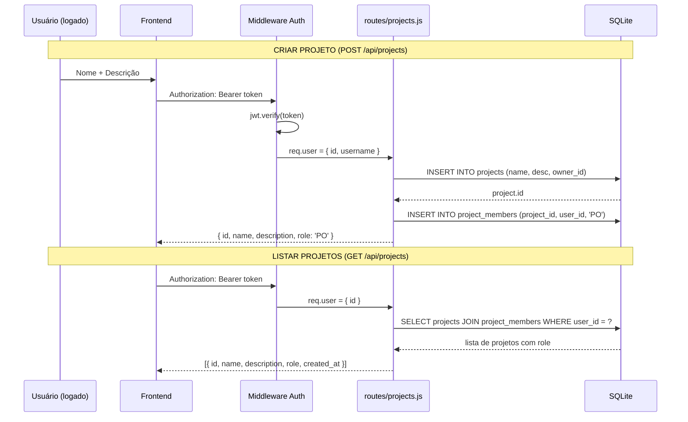
```mermaid
sequenceDiagram
    participant U as Usuário (logado)
    participant F as Frontend
    participant MW as Middleware Auth
    participant R as routes/projects.js
    participant DB as SQLite

    Note over U,DB: CRIAR PROJETO (POST /api/projects)
    U->>F: Nome + Descrição
    F->>MW: Authorization: Bearer token
    MW->>MW: jwt.verify(token)
    MW->>R: req.user = { id, username }
    R->>DB: INSERT INTO projects (name, desc, owner_id)
    DB-->>R: project.id
    R->>DB: INSERT INTO project_members (project_id, user_id, 'PO')
    R-->>F: { id, name, description, role: 'PO' }

    Note over U,DB: LISTAR PROJETOS (GET /api/projects)
    F->>MW: Authorization: Bearer token
    MW->>R: req.user = { id }
    R->>DB: SELECT projects JOIN project_members WHERE user_id = ?
    DB-->>R: lista de projetos com role
    R-->>F: [{ id, name, description, role, created_at }]
```

**Conceitos introduzidos:**
- **Criador = PO automático**: ao criar projeto, o dono é inserido em project_members como PO
- **INNER JOIN**: combina dados de projects + project_members para retornar o role do usuário
- **router.use(authMiddleware)**: aplica autenticação em TODAS as rotas do arquivo de uma vez

---

## Commit 10 — Adiciona rotas de convite e listagem de membros

**O que foi feito:** Implementou as rotas para convidar membros a um projeto (por email ou username) e listar os membros atuais. Apenas o dono do projeto pode convidar.

**Arquivos modificados:** `backend/src/routes/projects.js`

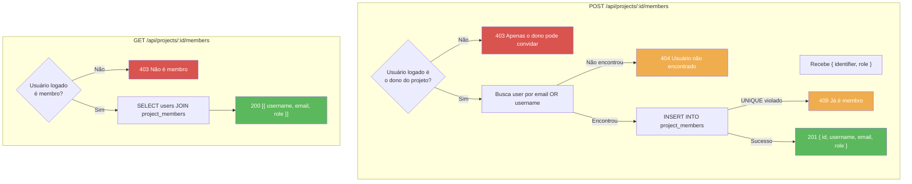
```mermaid
graph TB
    subgraph Convidar["POST /api/projects/:id/members"]
        C1["Recebe { identifier, role }"]
        C2{"Usuário logado é<br/>o dono do projeto?"}
        C2 -->|"Não"| C3["403 Apenas o dono pode convidar"]
        C2 -->|"Sim"| C4["Busca user por email OR username"]
        C4 -->|"Não encontrou"| C5["404 Usuário não encontrado"]
        C4 -->|"Encontrou"| C6["INSERT INTO project_members"]
        C6 -->|"UNIQUE violado"| C7["409 Já é membro"]
        C6 -->|"Sucesso"| C8["201 { id, username, email, role }"]
    end

    subgraph Listar["GET /api/projects/:id/members"]
        L1{"Usuário logado<br/>é membro?"}
        L1 -->|"Não"| L2["403 Não é membro"]
        L1 -->|"Sim"| L3["SELECT users JOIN project_members"]
        L3 --> L4["200 [{ username, email, role }]"]
    end

    style C3 fill:#d9534f,color:#fff
    style C5 fill:#f0ad4e,color:#fff
    style C7 fill:#f0ad4e,color:#fff
    style C8 fill:#5cb85c,color:#fff
    style L2 fill:#d9534f,color:#fff
    style L4 fill:#5cb85c,color:#fff
```

**Conceitos introduzidos:**
- **Busca flexível**: `WHERE email = ? OR username = ?` permite convidar por email ou username
- **Controle de acesso**: apenas owner_id pode convidar, qualquer membro pode listar
- **Tratamento de duplicata**: UNIQUE constraint capturada como erro 409

---

## Commit 11 — Adiciona página de lista de projetos no frontend

**O que foi feito:** Criou o componente Projects.tsx que exibe os projetos do usuário em cards com badges de role. Atualizou App.tsx com sistema de navegação por estado.

**Arquivos criados:** `frontend/src/pages/Projects.tsx`  
**Arquivos modificados:** `frontend/src/App.tsx`

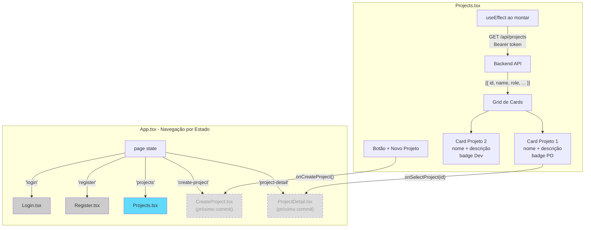
```mermaid
graph TB
    subgraph AppNavigation["App.tsx - Navegação por Estado"]
        State["page state"]
        State -->|"'login'"| Login["Login.tsx"]
        State -->|"'register'"| Register["Register.tsx"]
        State -->|"'projects'"| Projects["Projects.tsx"]
        State -->|"'create-project'"| CP["CreateProject.tsx<br/>(próximo commit)"]
        State -->|"'project-detail'"| PD["ProjectDetail.tsx<br/>(próximo commit)"]
    end

    subgraph ProjectsPage["Projects.tsx"]
        Mount["useEffect ao montar"] -->|"GET /api/projects<br/>Bearer token"| API["Backend API"]
        API -->|"[{ id, name, role, ... }]"| Grid["Grid de Cards"]
        Grid --> Card1["Card Projeto 1<br/>nome + descrição<br/>badge PO"]
        Grid --> Card2["Card Projeto 2<br/>nome + descrição<br/>badge Dev"]
        BtnNew["Botão + Novo Projeto"] -->|"onCreateProject()"| CP
        Card1 -->|"onSelectProject(id)"| PD
    end

    style Projects fill:#61dafb,color:#333
    style Login fill:#ccc,color:#333
    style Register fill:#ccc,color:#333
    style CP fill:#ddd,color:#999,stroke-dasharray: 5 5
    style PD fill:#ddd,color:#999,stroke-dasharray: 5 5
```

**Conceitos introduzidos:**
- **Navegação por estado**: em vez de react-router, usa useState para controlar qual página exibir
- **Grid responsivo**: `grid-cols-1 md:grid-cols-2 lg:grid-cols-3` adapta ao tamanho da tela
- **Role badges**: cores diferentes por papel (PO=roxo, SM=verde, Dev=azul)

---

## Commit 12 — Adiciona formulário de criação de projeto

**O que foi feito:** Criou o componente CreateProject.tsx com formulário para nome e descrição. Após criar, volta automaticamente para a lista de projetos.

**Arquivos criados:** `frontend/src/pages/CreateProject.tsx`  
**Arquivos modificados:** `frontend/src/App.tsx`

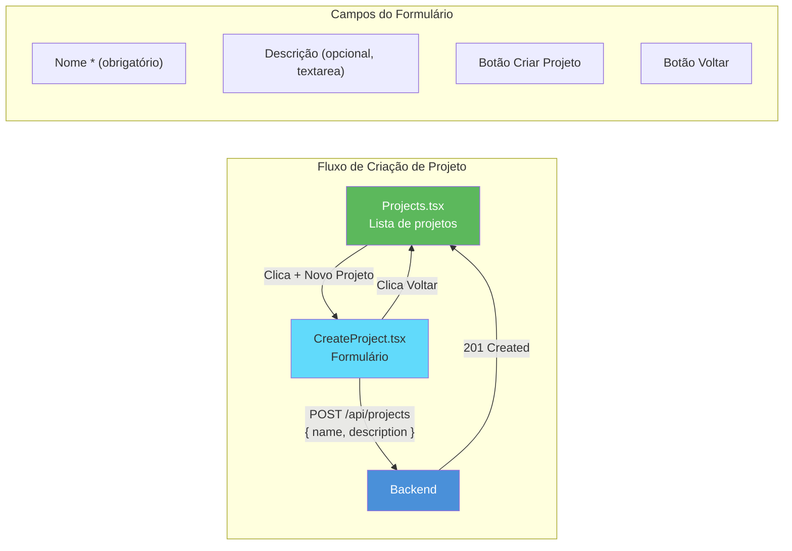
```mermaid
graph LR
    subgraph Fluxo["Fluxo de Criação de Projeto"]
        List["Projects.tsx<br/>Lista de projetos"]
        List -->|"Clica + Novo Projeto"| Form["CreateProject.tsx<br/>Formulário"]
        Form -->|"POST /api/projects<br/>{ name, description }"| API["Backend"]
        API -->|"201 Created"| List
        Form -->|"Clica Voltar"| List
    end

    subgraph FormFields["Campos do Formulário"]
        F1["Nome * (obrigatório)"]
        F2["Descrição (opcional, textarea)"]
        F3["Botão Criar Projeto"]
        F4["Botão Voltar"]
    end

    style Form fill:#61dafb,color:#333
    style List fill:#5cb85c,color:#fff
    style API fill:#4a90d9,color:#fff
```

**Conceitos introduzidos:**
- **textarea controlado**: campo de múltiplas linhas vinculado a useState
- **Callback de sucesso**: onCreated() muda o estado do App para voltar à lista
- **Token no header**: Authorization Bearer token em toda requisição autenticada

---

## Commit 13 — Adiciona página de detalhes do projeto com convite de membros

**O que foi feito:** Criou ProjectDetail.tsx com lista de membros atuais e formulário de convite (email/username + dropdown de role). App.tsx agora renderiza 3 páginas internas.

**Arquivos criados:** `frontend/src/pages/ProjectDetail.tsx`  
**Arquivos modificados:** `frontend/src/App.tsx`

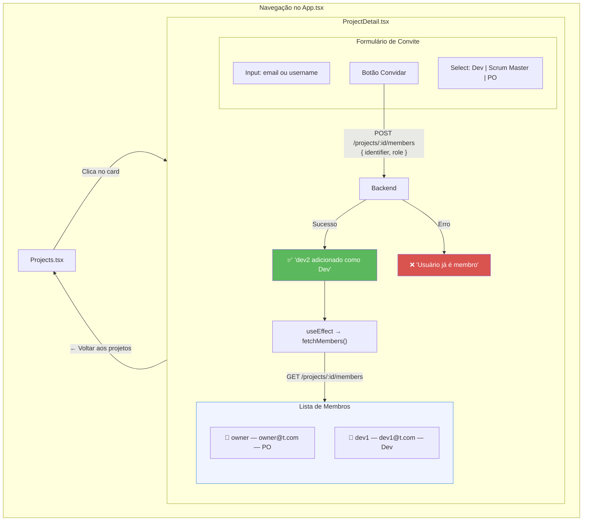
```mermaid
graph TB
    subgraph ProjectDetail["ProjectDetail.tsx"]
        Mount["useEffect → fetchMembers()"]
        Mount -->|"GET /projects/:id/members"| MemberList

        subgraph MemberList["Lista de Membros"]
            M1["👤 owner — owner@t.com — PO"]
            M2["👤 dev1 — dev1@t.com — Dev"]
        end

        subgraph InviteForm["Formulário de Convite"]
            Input["Input: email ou username"]
            Select["Select: Dev | Scrum Master | PO"]
            Btn["Botão Convidar"]
        end

        Btn -->|"POST /projects/:id/members<br/>{ identifier, role }"| API["Backend"]
        API -->|"Sucesso"| Success["✅ 'dev2 adicionado como Dev'"]
        API -->|"Erro"| Error["❌ 'Usuário já é membro'"]
        Success --> Mount
    end

    subgraph Navigation["Navegação no App.tsx"]
        Projects["Projects.tsx"] -->|"Clica no card"| ProjectDetail
        ProjectDetail -->|"← Voltar aos projetos"| Projects
    end

    style Success fill:#5cb85c,color:#fff
    style Error fill:#d9534f,color:#fff
    style MemberList fill:#f0f4ff,stroke:#4a90d9
```

**Conceitos introduzidos:**
- **Refresh após ação**: fetchMembers() é chamado novamente após convite bem-sucedido
- **select controlado**: dropdown HTML vinculado a useState com 3 opções de role
- **Feedback visual**: mensagens de sucesso (verde) e erro (vermelho) distintas

---

## Commit 14 — Atualiza CLAUDE.md com endpoints, estrutura e diagrama da US2

**O que foi feito:** Atualizou a documentação do projeto: novos endpoints (projects, members), estrutura de diretórios expandida, diagrama de arquitetura atualizado e US2 marcada como concluída.

**Arquivos modificados:** `CLAUDE.md`, `docs/commits.md`

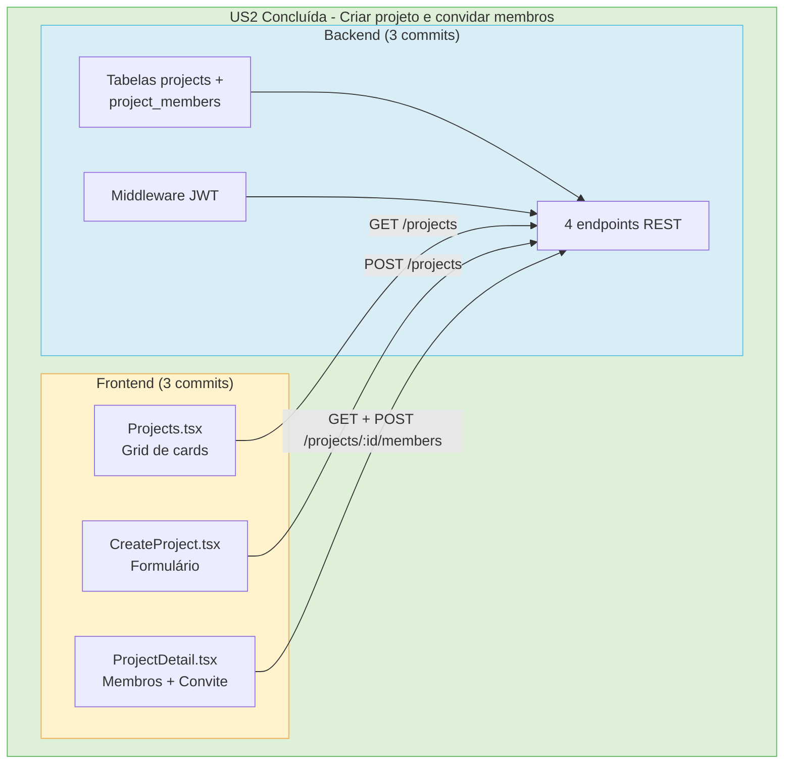
```mermaid
graph TB
    subgraph US2["US2 Concluída - Criar projeto e convidar membros"]
        subgraph BackendUS2["Backend (3 commits)"]
            DB["Tabelas projects +<br/>project_members"]
            MW["Middleware JWT"]
            Routes["4 endpoints REST"]
        end

        subgraph FrontendUS2["Frontend (3 commits)"]
            ProjList["Projects.tsx<br/>Grid de cards"]
            ProjCreate["CreateProject.tsx<br/>Formulário"]
            ProjDetail["ProjectDetail.tsx<br/>Membros + Convite"]
        end
    end

    DB --> Routes
    MW --> Routes
    ProjList -->|"GET /projects"| Routes
    ProjCreate -->|"POST /projects"| Routes
    ProjDetail -->|"GET + POST /projects/:id/members"| Routes

    style US2 fill:#dff0d8,stroke:#5cb85c
    style BackendUS2 fill:#d9edf7,stroke:#5bc0de
    style FrontendUS2 fill:#fef3cd,stroke:#f0ad4e
```

**Resumo da US2:** 7 commits, ~600 linhas, backend completo com auth middleware + CRUD projetos + membros, frontend com 3 novas páginas e navegação por estado.

---

## Commit 15 — Adiciona tabela invitations para convites pendentes

**O que foi feito:** Criou a tabela `invitations` para suportar fluxo de convite com aceitar/rejeitar. Antes, convidar adicionava direto em `project_members` (sem aceitação). Agora será um convite pendente.

**Arquivos modificados:** `backend/src/database.js`

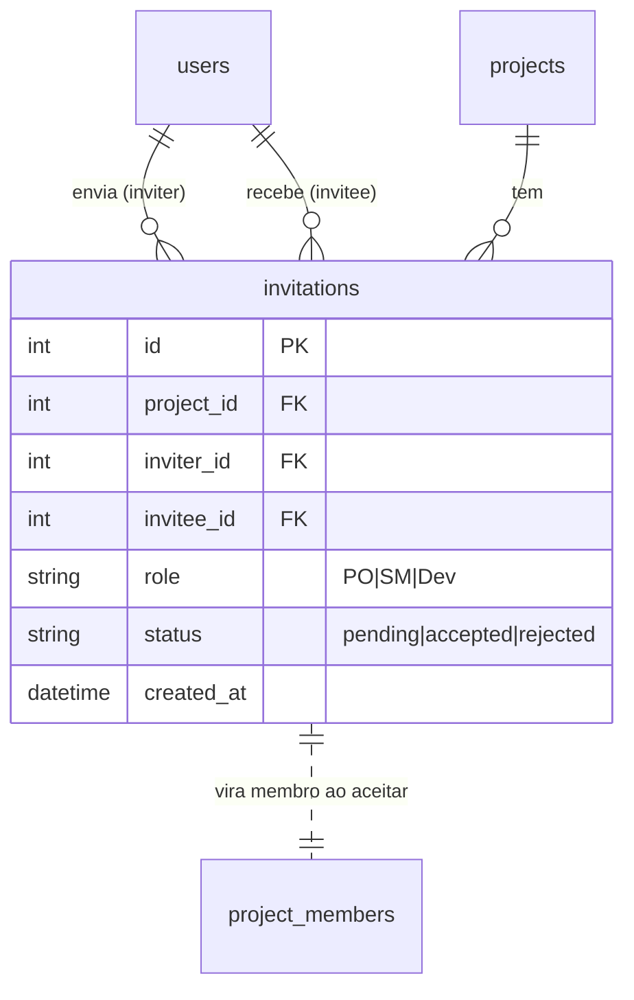
```mermaid
erDiagram
    users ||--o{ invitations : "envia (inviter)"
    users ||--o{ invitations : "recebe (invitee)"
    projects ||--o{ invitations : "tem"
    invitations {
        int id PK
        int project_id FK
        int inviter_id FK
        int invitee_id FK
        string role "PO|SM|Dev"
        string status "pending|accepted|rejected"
        datetime created_at
    }
    invitations ||..|| project_members : "vira membro ao aceitar"
```

**Conceitos introduzidos:**
- **Status enum**: pending (aguardando), accepted (virou membro), rejected (recusou)
- **Histórico preservado**: convites rejeitados/aceitos ficam no banco para auditoria
- **2 FKs ao users**: inviter_id e invitee_id apontam para a mesma tabela

---

## Commit 16 — Refatora rota de convite para criar invitation pendente

**O que foi feito:** A rota `POST /api/projects/:id/members` agora cria um registro em `invitations` com status `pending` em vez de adicionar direto em `project_members`. O convidado precisará aceitar o convite.

**Arquivos modificados:** `backend/src/routes/projects.js`

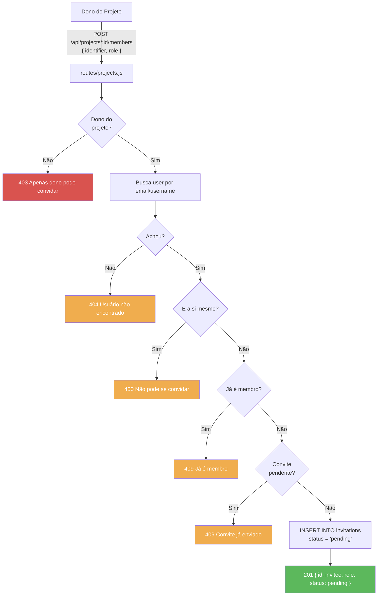
```mermaid
graph TB
    Owner["Dono do Projeto"] -->|"POST /api/projects/:id/members<br/>{ identifier, role }"| Route["routes/projects.js"]

    Route --> Check1{"Dono do<br/>projeto?"}
    Check1 -->|"Não"| E1["403 Apenas dono pode convidar"]
    Check1 -->|"Sim"| Check2["Busca user por email/username"]

    Check2 --> Check3{"Achou?"}
    Check3 -->|"Não"| E2["404 Usuário não encontrado"]
    Check3 -->|"Sim"| Check4{"É a si mesmo?"}

    Check4 -->|"Sim"| E3["400 Não pode se convidar"]
    Check4 -->|"Não"| Check5{"Já é membro?"}

    Check5 -->|"Sim"| E4["409 Já é membro"]
    Check5 -->|"Não"| Check6{"Convite<br/>pendente?"}

    Check6 -->|"Sim"| E5["409 Convite já enviado"]
    Check6 -->|"Não"| Insert["INSERT INTO invitations<br/>status = 'pending'"]

    Insert --> Success["201 { id, invitee, role, status: pending }"]

    style E1 fill:#d9534f,color:#fff
    style E2 fill:#f0ad4e,color:#fff
    style E3 fill:#f0ad4e,color:#fff
    style E4 fill:#f0ad4e,color:#fff
    style E5 fill:#f0ad4e,color:#fff
    style Success fill:#5cb85c,color:#fff
```

**Conceitos introduzidos:**
- **Validações em cascata**: cada erro tem código HTTP apropriado e mensagem específica
- **Auto-convite bloqueado**: 400 se o dono tentar se convidar
- **Idempotência**: não cria convite duplicado se já existe um pendente

---

## Commit 17 — Adiciona rotas de listar/aceitar/rejeitar convites

**O que foi feito:** Criou `routes/invitations.js` com 3 rotas para o convidado gerenciar seus convites pendentes. Aceitar usa transação SQL para atomicidade.

**Arquivos criados:** `backend/src/routes/invitations.js`  
**Arquivos modificados:** `backend/src/server.js`

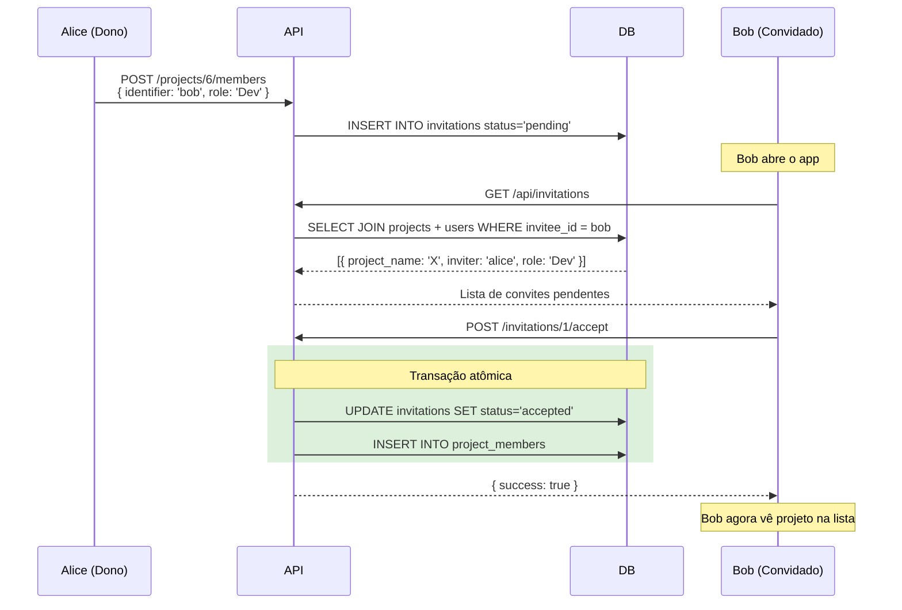
```mermaid
sequenceDiagram
    participant Inviter as Alice (Dono)
    participant API
    participant DB
    participant Invitee as Bob (Convidado)

    Inviter->>API: POST /projects/6/members<br/>{ identifier: 'bob', role: 'Dev' }
    API->>DB: INSERT INTO invitations status='pending'

    Note over Invitee: Bob abre o app
    Invitee->>API: GET /api/invitations
    API->>DB: SELECT JOIN projects + users WHERE invitee_id = bob
    DB-->>API: [{ project_name: 'X', inviter: 'alice', role: 'Dev' }]
    API-->>Invitee: Lista de convites pendentes

    Invitee->>API: POST /invitations/1/accept

    rect rgb(220, 240, 220)
        Note over API,DB: Transação atômica
        API->>DB: UPDATE invitations SET status='accepted'
        API->>DB: INSERT INTO project_members
    end

    API-->>Invitee: { success: true }
    Note over Invitee: Bob agora vê projeto na lista
```

**Conceitos introduzidos:**
- **Transação SQL**: `db.transaction()` garante que UPDATE + INSERT executam atomicamente
- **JOIN triplo**: invitations + projects + users para retornar contexto completo
- **Idempotência via WHERE**: aceitar/rejeitar duas vezes retorna 404 (não dá erro grave)

---

## Commit 18 — Adiciona sino de notificações e painel de convites no app

**O que foi feito:** Criou `InvitationsPanel.tsx` (dropdown com lista de convites pendentes e botões aceitar/rejeitar). Adicionou no header do App.tsx um sino 🔔 com badge vermelho mostrando a quantidade de convites pendentes. Polling a cada 10s atualiza o contador.

**Arquivos criados:** `frontend/src/pages/InvitationsPanel.tsx`  
**Arquivos modificados:** `frontend/src/App.tsx`

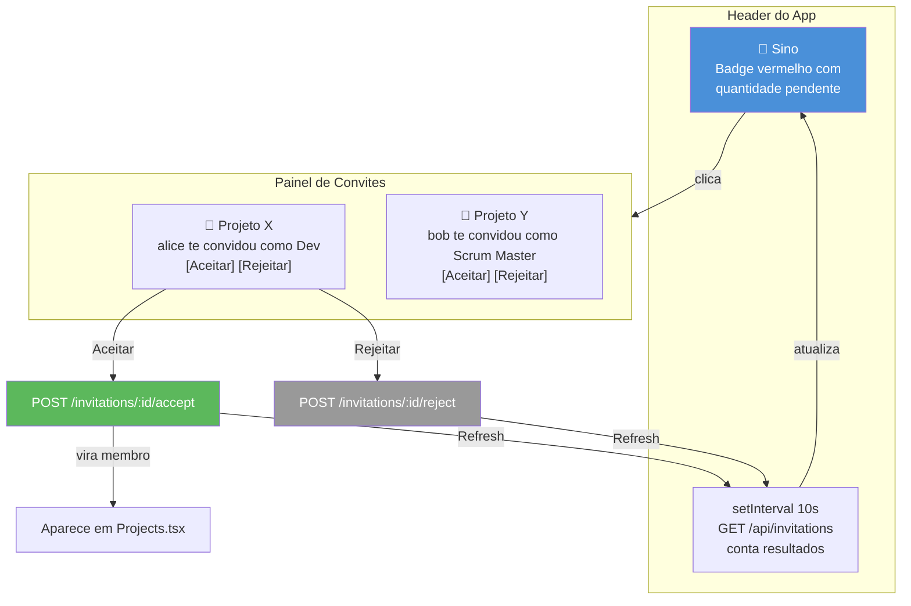
```mermaid
graph TB
    subgraph Header["Header do App"]
        Bell["🔔 Sino<br/>Badge vermelho com<br/>quantidade pendente"]
        Polling["setInterval 10s<br/>GET /api/invitations<br/>conta resultados"]
        Polling -->|"atualiza"| Bell
    end

    Bell -->|"clica"| Panel["InvitationsPanel<br/>(dropdown)"]

    subgraph Panel["Painel de Convites"]
        Card1["📁 Projeto X<br/>alice te convidou como Dev<br/>[Aceitar] [Rejeitar]"]
        Card2["📁 Projeto Y<br/>bob te convidou como Scrum Master<br/>[Aceitar] [Rejeitar]"]
    end

    Card1 -->|"Aceitar"| Accept["POST /invitations/:id/accept"]
    Card1 -->|"Rejeitar"| Reject["POST /invitations/:id/reject"]
    Accept -->|"Refresh"| Polling
    Reject -->|"Refresh"| Polling
    Accept -->|"vira membro"| ProjectsList["Aparece em Projects.tsx"]

    style Bell fill:#4a90d9,color:#fff
    style Accept fill:#5cb85c,color:#fff
    style Reject fill:#999,color:#fff
```

**Conceitos introduzidos:**
- **Polling com setInterval**: atualiza badge a cada 10s sem WebSocket
- **Cleanup do useEffect**: `return () => clearInterval()` evita memory leak
- **Badge condicional**: número só aparece se houver convites (pendingInvites > 0)
- **Dropdown absoluto**: posição `absolute` para flutuar sobre o conteúdo

---

## Commit 19 — Ajusta mensagem de convite + atualiza CLAUDE.md

**O que foi feito:** Mudou a mensagem de sucesso em ProjectDetail para refletir que o convite agora é pendente (não direto). Adicionou os 3 endpoints de invitations na tabela do CLAUDE.md.

**Arquivos modificados:** `frontend/src/pages/ProjectDetail.tsx`, `CLAUDE.md`

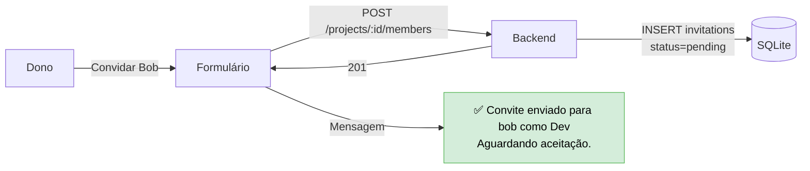
```mermaid
graph LR
    Owner["Dono"] -->|"Convidar Bob"| Form["Formulário"]
    Form -->|"POST /projects/:id/members"| API["Backend"]
    API -->|"INSERT invitations<br/>status=pending"| DB[(SQLite)]
    API -->|"201"| Form
    Form -->|"Mensagem"| Msg["✅ Convite enviado para bob como Dev<br/>Aguardando aceitação."]

    style Msg fill:#d4edda,stroke:#5cb85c,color:#000
```

**Fluxo completo do sistema de convites:**
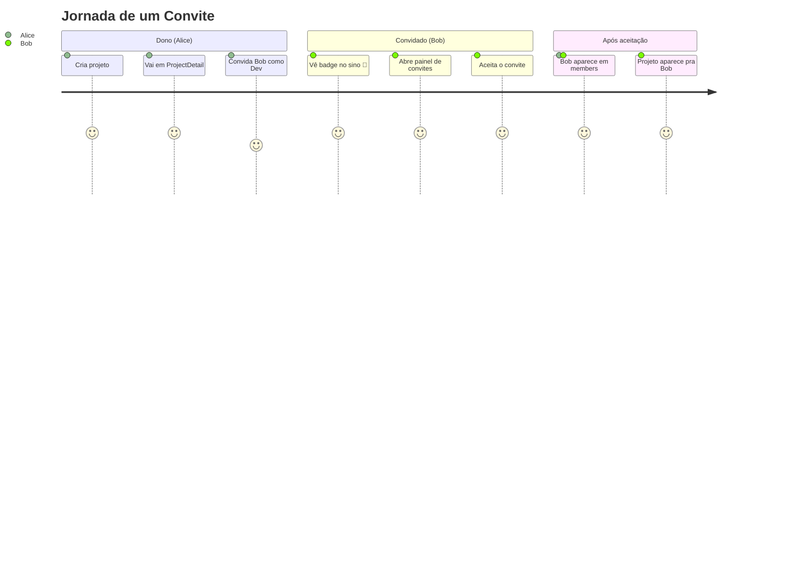
```mermaid
journey
    title Jornada de um Convite
    section Dono (Alice)
      Cria projeto: 5: Alice
      Vai em ProjectDetail: 5: Alice
      Convida Bob como Dev: 4: Alice
    section Convidado (Bob)
      Vê badge no sino 🔔: 5: Bob
      Abre painel de convites: 5: Bob
      Aceita o convite: 5: Bob
    section Após aceitação
      Bob aparece em members: 5: Alice, Bob
      Projeto aparece pra Bob: 5: Bob
```

---

## Commit 20 — Adiciona tabela user_stories para backlog (US3)

**O que foi feito:** Criou a tabela `user_stories` que armazena as histórias de usuário do backlog. Suporta também sprint_id (US5) e status (US6) para uso futuro.

**Arquivos modificados:** `backend/src/database.js`

```mermaid
erDiagram
    projects ||--o{ user_stories : "contém"
    user_stories {
        int id PK
        int project_id FK
        string title "Como X, quero Y..."
        string description
        string acceptance_criteria
        int story_points "1, 2, 3, 5, 8, 13"
        string label "feature|bug|tech_debt"
        int priority "ordem no backlog"
        string status "to_do|in_progress|in_review|done"
        int sprint_id "NULL = backlog"
        datetime created_at
    }
```

**Conceitos introduzidos:**
- **CHECK constraints**: garante valores válidos para label e status
- **sprint_id NULLable**: NULL significa "ainda no backlog", preenchido = está em sprint
- **priority**: campo numérico para drag & drop reordenar (US3 final)

---

## Commit 21 — Adiciona rotas POST e GET de histórias (backlog)

**O que foi feito:** Criou `routes/stories.js` com endpoints para criar e listar histórias do backlog. Apenas membros do projeto podem usar. Histórias novas vão para o final do backlog (priority crescente).

**Arquivos criados:** `backend/src/routes/stories.js`  
**Arquivos modificados:** `backend/src/server.js`

```mermaid
graph TB
    subgraph Routes["routes/stories.js"]
        Helper["isMember(projectId, userId)<br/>Helper para validação"]

        POST["POST /api/projects/:id/stories"]
        GET["GET /api/projects/:id/stories<br/>?include=all (default: backlog only)"]

        POST -->|"chama"| Helper
        GET -->|"chama"| Helper
    end

    POST -->|"calcula priority = MAX+1"| MaxQuery["SELECT MAX(priority)"]
    POST -->|"INSERT"| Stories[("user_stories")]
    GET -->|"SELECT WHERE sprint_id IS NULL<br/>ORDER BY priority"| Stories

    style Helper fill:#7c3aed,color:#fff
    style POST fill:#5cb85c,color:#fff
    style GET fill:#4a90d9,color:#fff
```

**Conceitos introduzidos:**
- **Helper isMember**: extrai validação de acesso comum em uma função reutilizável
- **Auto-priority**: priority = MAX+1 garante ordem cronológica de adição
- **Filtro condicional via query**: `?include=all` muda comportamento sem criar nova rota
- **Mount em /api**: necessário porque a URL é `/api/projects/:id/stories` (aninhada)

---

## Commit 22 — Adiciona rotas PUT e DELETE de histórias

**O que foi feito:** Adicionou `PUT /api/stories/:id` (atualização parcial via COALESCE) e `DELETE /api/stories/:id`. Helper `getStoryAndCheckAccess` valida existência da história e acesso do usuário.

**Arquivos modificados:** `backend/src/routes/stories.js`

```mermaid
graph TB
    subgraph Helper["getStoryAndCheckAccess(id, userId)"]
        H1["SELECT story WHERE id = ?"]
        H1 --> H2{"Existe?"}
        H2 -->|"Não"| E1["404 Não encontrada"]
        H2 -->|"Sim"| H3{"User é membro<br/>do projeto?"}
        H3 -->|"Não"| E2["403 Sem acesso"]
        H3 -->|"Sim"| OK["✓ Retorna { story }"]
    end

    PUT["PUT /api/stories/:id"] --> Helper
    DELETE["DELETE /api/stories/:id"] --> Helper

    PUT -->|"OK"| Update["UPDATE com COALESCE<br/>(atualização parcial)"]
    DELETE -->|"OK"| Del["DELETE FROM user_stories"]

    Update --> Return["Retorna história atualizada"]
    Del --> Success["{ success: true }"]

    style E1 fill:#f0ad4e,color:#fff
    style E2 fill:#d9534f,color:#fff
    style OK fill:#5cb85c,color:#fff
```

**Conceitos introduzidos:**
- **COALESCE em UPDATE**: `SET col = COALESCE(?, col)` mantém valor antigo se NULL enviado
- **PATCH semântico via PUT**: aceita campos parciais sem precisar enviar tudo
- **DRY com helper**: lógica de validação extraída em função reutilizável

---

## Commit 23 — Adiciona página Backlog e StoryForm modal

**O que foi feito:** Criou o Backlog (lista de histórias com label colorido, story points, editar/remover) e o StoryForm (modal para criar/editar com Fibonacci de pontos). ProjectDetail tem botão "Abrir Backlog".

**Arquivos criados:** `Backlog.tsx`, `StoryForm.tsx`  
**Arquivos modificados:** `ProjectDetail.tsx`, `App.tsx`

```mermaid
graph TB
    subgraph Backlog["Backlog.tsx"]
        Header["Cabeçalho<br/>+ Nova História"]
        StoryList["Lista de histórias"]

        Story1["📘 #1 [feature] Como user, quero login (3 pts)<br/>[Editar] [Remover]"]
        Story2["🐛 #2 [bug] Senha não valida (1 pts)<br/>[Editar] [Remover]"]
        Story3["⚙️ #3 [tech_debt] Refatorar auth (5 pts)<br/>[Editar] [Remover]"]

        StoryList --> Story1 & Story2 & Story3
    end

    Header -->|"clica + Nova"| Modal
    Story1 -->|"clica Editar"| Modal["StoryForm Modal"]

    subgraph Modal["StoryForm.tsx (modal)"]
        Title["Input título"]
        Desc["Textarea descrição"]
        Points["Select pontos: 0,1,2,3,5,8,13,21"]
        Label["Select label: feature/bug/tech_debt"]
        Save["[Salvar]"]
    end

    Save -->|"POST se nova<br/>PUT se editar"| API["Backend"]
    API -->|"refresh"| StoryList

    style Story1 fill:#dbeafe,stroke:#4a90d9
    style Story2 fill:#fee2e2,stroke:#d9534f
    style Story3 fill:#fef3c7,stroke:#f0ad4e
```

**Conceitos introduzidos:**
- **Modal com overlay**: `fixed inset-0 bg-black bg-opacity-50` cria fundo escurecido
- **stopPropagation**: clique dentro do form não fecha o modal (só clique no overlay)
- **Fibonacci para pontos**: padrão Scrum (0, 1, 2, 3, 5, 8, 13, 21)
- **Mesmo form para criar/editar**: prop `story` decide POST vs PUT

---

## Commit 24 — Adiciona tabela sprints para gestão de ciclos (US4)

**O que foi feito:** Criou a tabela `sprints` no banco. Sprints são o ciclo de trabalho do time Scrum, têm datas, meta e status (planning/active/completed). Histórias do backlog passarão a ter `sprint_id` apontando para esta tabela na US5.

**Arquivos modificados:** `backend/src/database.js`

```mermaid
erDiagram
    projects ||--o{ sprints : "tem ciclos"
    sprints ||--o{ user_stories : "(US5) recebe histórias"
    sprints {
        int id PK
        int project_id FK
        string name "Sprint 1"
        string goal "Meta do sprint"
        string start_date "YYYY-MM-DD"
        string end_date "YYYY-MM-DD"
        string status "planning|active|completed"
        datetime created_at
    }
```

**Conceitos introduzidos:**
- **Status como enum via CHECK**: 3 estados válidos garantidos no banco
- **Datas como TEXT (ISO)**: SQLite armazena datas como string YYYY-MM-DD (formato lex-ordenável)
- **DEFAULT 'planning'**: sprint nasce em planejamento (status inicial natural)
