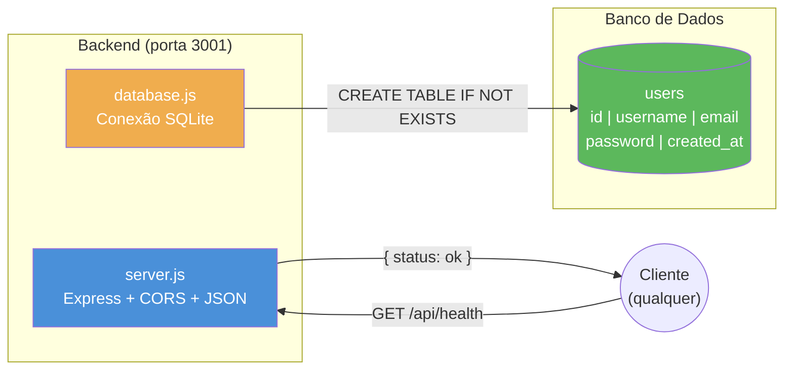
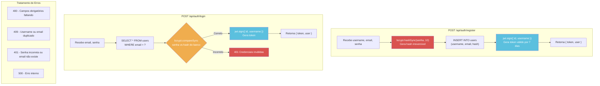
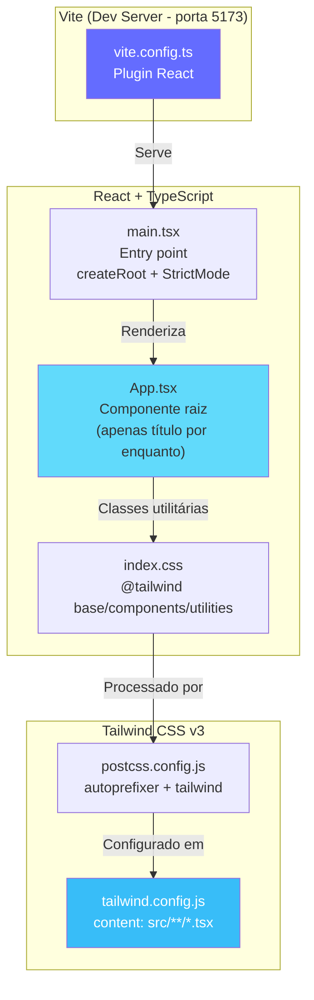
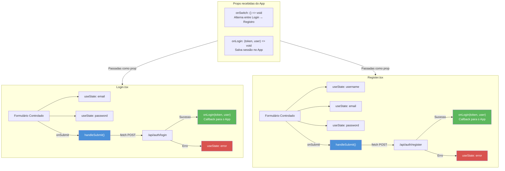
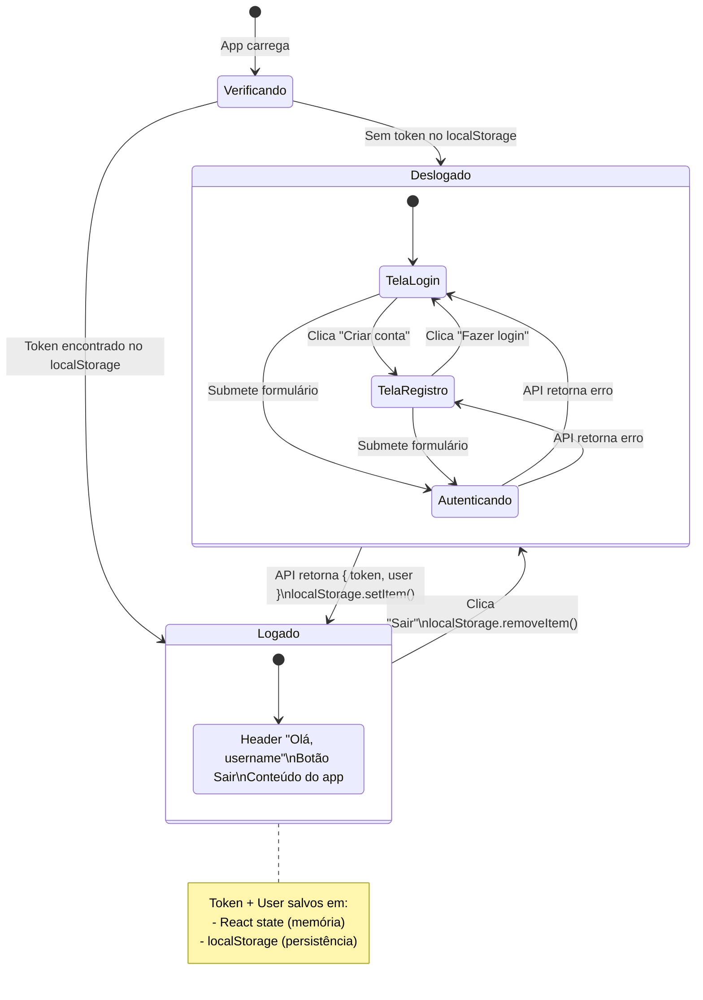
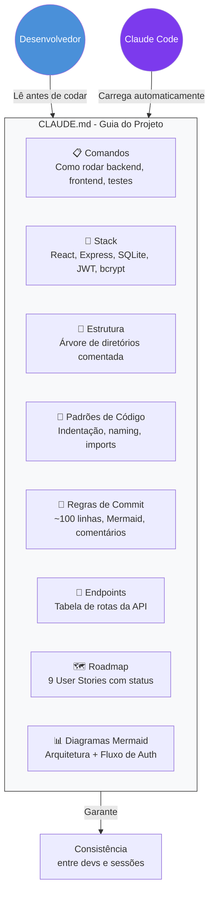
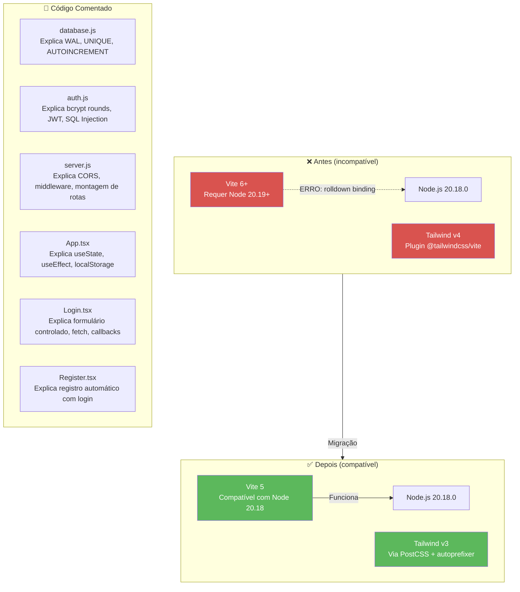
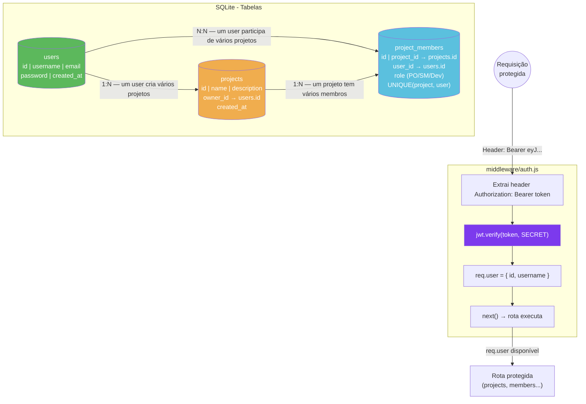
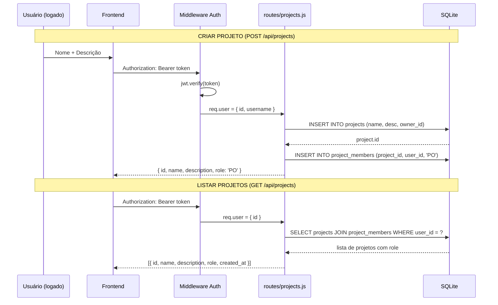

# Histórico de Commits - Sprint Planner

Documentação visual de cada commit com diagramas Mermaid mostrando a evolução da arquitetura.

---

## Commit 1 — `10dd475` Inicializa backend com Express e banco SQLite

**O que foi feito:** Criou a base do servidor backend com Express e o banco de dados SQLite com a tabela de usuários.

**Arquivos criados:** `.gitignore`, `backend/package.json`, `backend/src/server.js`, `backend/src/database.js`

**Conceitos introduzidos:**
- Express como framework HTTP
- SQLite como banco local (arquivo `.db`)
- CORS para permitir requisições cross-origin
- Health check como rota de verificação

---

## Commit 2 — `acf9b2a` Adiciona rotas de registro e login com JWT

**O que foi feito:** Implementou as duas rotas de autenticação: registro (criar conta) e login. Usa bcrypt para hash de senhas e JWT para tokens.

**Arquivos criados:** `backend/src/routes/auth.js`  
**Arquivos modificados:** `backend/src/server.js` (adicionou import + montagem das rotas)

**Conceitos introduzidos:**
- **bcrypt**: hash de senha com salt (10 rounds) — irreversível, mesmo com acesso ao banco não se descobre a senha
- **JWT**: token assinado digitalmente contendo `{ id, username }`, expira em 7 dias
- **Prepared statements** (`?`): previnem SQL Injection
- **Mensagem genérica de erro** no login: não revela se o email existe ou se a senha está errada

---

## Commit 3 — `18c9474` Inicializa frontend React + TypeScript com Tailwind CSS

**O que foi feito:** Criou o projeto frontend com Vite (scaffold React + TypeScript). Configurou Tailwind CSS para estilização. Limpou os arquivos de template.

**Arquivos criados:** Todo o diretório `frontend/` (scaffold Vite)  
**Arquivos modificados:** `App.tsx` (limpou template), `index.css` (Tailwind), `vite.config.ts` (plugin)

**Conceitos introduzidos:**
- **Vite**: bundler rápido com HMR (Hot Module Replacement)
- **TypeScript**: tipagem estática para JavaScript
- **Tailwind CSS**: classes utilitárias (`bg-blue-700`, `p-4`, `rounded`) direto no HTML
- **Scaffold limpo**: removeu boilerplate do Vite (logos, contador, CSS padrão)

---

## Commit 4 — `a4adcec` Adiciona páginas de Login e Registro

**O que foi feito:** Criou os dois componentes de formulário (Login e Register) com validação, chamadas à API e exibição de erros.

**Arquivos criados:** `frontend/src/pages/Login.tsx`, `frontend/src/pages/Register.tsx`

**Conceitos introduzidos:**
- **Formulários controlados**: cada input vinculado a um `useState` — React controla o valor
- **Props com callback**: filho (Login) avisa o pai (App) quando o login é bem-sucedido via `onLogin()`
- **fetch API**: requisições HTTP nativas do navegador para o backend
- **Validação HTML5**: `required` e `type="email"` validam antes de enviar

---

## Commit 5 — `74ed7d8` Integra autenticação no App com persistência em localStorage

**O que foi feito:** Conectou Login e Register ao App.tsx. Gerencia o estado de autenticação (logado/deslogado) com persistência no localStorage para sobreviver a recarregamentos.

**Arquivos modificados:** `frontend/src/App.tsx`

**Conceitos introduzidos:**
- **localStorage**: armazenamento no navegador que persiste após fechar a aba
- **useEffect**: roda ao carregar o componente para recuperar sessão salva
- **Renderização condicional**: `if (!token)` decide qual tela mostrar
- **Lifting state up**: App é o "dono" do estado de auth, filhos comunicam via callbacks

---

## Commit 6 — `45555c0` Adiciona CLAUDE.md com padrões do projeto e diagramas Mermaid

**O que foi feito:** Criou o arquivo CLAUDE.md documentando stack, estrutura, comandos, regras de commit, endpoints e diagramas de arquitetura.

**Arquivos criados:** `CLAUDE.md`

**Conceitos introduzidos:**
- **CLAUDE.md**: arquivo de instruções persistentes carregado pelo Claude Code em toda sessão
- **Diagramas Mermaid**: visualização de arquitetura renderizada no GitHub
- **Roadmap com checklist**: tracking visual do progresso das user stories

---

## Commit 7 — `acfd105` Comenta todo o código e corrige compatibilidade Vite 5 + Tailwind v3

**O que foi feito:** Adicionou comentários explicativos em todos os arquivos. Corrigiu incompatibilidade do Vite 6 com Node 20.18, migrando para Vite 5 + Tailwind v3 com PostCSS.

**Arquivos modificados:** Todos os arquivos de código do backend e frontend

**Conceitos introduzidos:**
- **Compatibilidade de versões**: Node 20.18 não suporta Vite 6+ (que usa rolldown nativo)
- **PostCSS**: processador CSS que o Tailwind v3 usa para compilar as classes utilitárias
- **Código auto-documentado**: comentários explicando o "porquê" de cada decisão

---

## Commit 8 — Adiciona tabelas projects/project_members e middleware JWT

**O que foi feito:** Criou as tabelas de projetos e membros no banco de dados. Criou o middleware de autenticação JWT que protege rotas privadas.

**Arquivos criados:** `backend/src/middleware/auth.js`  
**Arquivos modificados:** `backend/src/database.js`

**Conceitos introduzidos:**
- **FOREIGN KEY**: garante integridade referencial (owner_id deve existir em users)
- **CHECK constraint**: role só aceita 'PO', 'Scrum Master' ou 'Dev' no nível do banco
- **UNIQUE composto**: (project_id, user_id) impede membro duplicado
- **Middleware Express**: função que intercepta a requisição antes da rota, ideal para auth

---

## Commit 9 — Adiciona rotas CRUD de projetos (criar e listar)

**O que foi feito:** Criou as rotas para criar e listar projetos. O criador do projeto é automaticamente adicionado como PO. Todas as rotas são protegidas pelo middleware JWT.

**Arquivos criados:** `backend/src/routes/projects.js`  
**Arquivos modificados:** `backend/src/server.js` (monta rotas em /api/projects)

**Conceitos introduzidos:**
- **Criador = PO automático**: ao criar projeto, o dono é inserido em project_members como PO
- **INNER JOIN**: combina dados de projects + project_members para retornar o role do usuário
- **router.use(authMiddleware)**: aplica autenticação em TODAS as rotas do arquivo de uma vez
